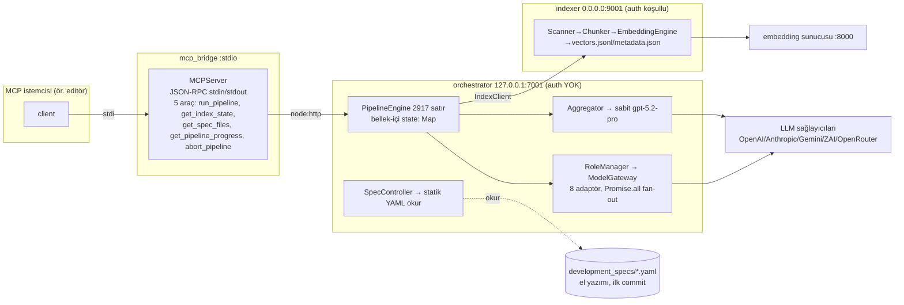

# LLM Council Orchestrator — Harness Evrimi Değerlendirmesi

> **Denetim tarihi**: 2026-08-17 · **Denetlenen ana depo**: isakli05/llm_council_orchestrator @ `a5347e69ea5d726bd6c6bd6201385bfdb886ac5c` (main, temiz) · **Karşılaştırma deposu**: Kuberwastaken/claurst @ `595b0ebe3e8afbfb71881bf95454a2ecb7b1d54c` (v0.1.7)
> **Yöntem**: 8 uzman işçi (A–H) salt-okunur denetimi + ebeveyn çapraz doğrulaması (tüm kritik bulgular ikinci kez kanıtlandı) + dondurulmuş bulgu seti (audit-output/evidence-index.md).
> **Durum**: SALT-OKUNUR denetim — depolarda hiçbir değişiklik yapılmadı; tüm çıktılar `audit-output/` altında.

---

## 1. Yönetici Hükmü

# **MODULAR RE-PLATFORM** (H-modifiyeli: MCP-öncelikli, çalışma-zamanından bağımsız)

**Gerekçe (bir sayfa):** Depo bugün ne bir "konsey"dir (aynı promptun paralel fan-out'u + sabit tek modele sentez — hesaplanmış hiçbir uzlaşı mekanizması yok), ne bir kodlama-ajan harness'idir (20 yetenekten ~16'sı tamamen yok; CLI/bin yok; PTY/oturum/worktree/izin yok), ne de çalışan bir spec üreticisidir (SPEC modunun eponim adımı placeholder başarı döner; REFINEMENT sıfır gerçek LLM çağrısıyla "başarılı" olur; spec API ilk commit'ten kalma el yazımı statik YAML sunar). Build kırık (85 TS hatası), testlerin %12'si başarısız (60/491), CI sıfır, ve kamu deposunda commit'lenmiş canlı API anahtarı var. **Buna karşın** içinde gerçek değer gömülüdür: indexer zinciri, keşif motoru (kod tabanını gerçekten tarar), çoklu sağlayıcı adaptör deneyimi, dürüst iç denetim belgeleri. Bu değer, çerçevesiz bir TypeScript çekirdeğe **kazı ilkesiyle** (her modül yeniden yazım maliyetiyle kıyaslanır) taşınmalı; motor **MCP sunucusu + CLI** olarak açılmalı ve dış harness'ler (öncül istemci OMP; yedek kendi ince A-lite döngümüz — Pi değil) MCP üzerinden sürülmelidir. Konsey protokolü + Spec IR derleyicisi (hiçbir adayda olmayan iki farklılaştırıcı) Aşama 2.5'te **ölçülebilir kanıt kapısından** geçmeden harness'e tek saat harcanmamalıdır. Claurst GPL-3.0 + sızıntı soyağdı + TLS-taklidi riskleri nedeniyle temel/fork olamaz; yalnız karşılaştırma ve (kullanıcının kendi makinesinde) black-box eş-ajan olarak kalır.

---

## 2. Depo anlık görüntüleri

| Özellik | llm_council_orchestrator | claurst |
|---|---|---|
| Remote | github.com/isakli05/llm_council_orchestrator (public) | github.com/Kuberwastaken/claurst (eski /claude-code → 301) |
| HEAD / tarih | a5347e6 (main), 2026-03-09, temiz ağaç | 595b0eb (main), pushed 2026-07-31, temiz klon |
| Boyut/yapı | 349 dosya; apps/{orchestrator,mcp_bridge,indexer}+4 shared pkg; TS | ~148K satır; src-rust/ altında 12 crate; Rust workspace |
| Commit/katılımcı | 5 commit, 1 katılımcı | 547 commit, 31 kimlik, 10.249 yıldız/7.774 fork |
| Etiket/release | YOK (0 tag, 0 release) | v0.1.7 (2026-07-06), CI-derlemeli 5 platform artifact'ı |
| CI | **0 workflow** (README badge'i var olmayan ci.yml'a işaret eder) | ci.yml + release.yml + auto-release + npm-publish + pages |
| Lisans | LICENSE: MIT (kök) | GPL-3.0 (yalnız; çift lisans yok) |
| Giriş noktası | server.ts'ler (HTTP/stdio); **bin yok** | claurst ikilisi (36.3 MB release, bu makinede derlendi) |
| Erişim zamanı | 2026-08-17 02:0x–03:0x (+03) | 2026-08-16T23:24Z–2026-08-17T00:0xZ |

Bu denetim sırasında ana depo HEAD'i değişmedi (referans commit a5347e6 = denetlenen commit). Claurst HEAD'i preflight SHA ile aynı.

## 3. Güncel mimari gerçeklik haritası



Veri akışı özeti: MCP/HTTP → PipelineEngine (adım motoru: bellek-içi, restart'ta kaybolur) → index (indexer→embedding) → discover (SignalExtractor repo dosyalarını tarar) → analiz (rol başına M model paralel) → aggregate (tek sentez çağrısı) → HTTP/MCP yanıtı. Kalıcılık: yalnız indexer'ın vectors.jsonl/metadata.json dosyaları; pipeline sonuçları HİÇBİR yere yazılmaz.

## 4. Dokümantasyon iddiaları vs gerçeklik

| İddia | Kaynak | Gerçeklik |
|---|---|---|
| "Placeholders: 0", "TODO: 0" | .audit/09_FINAL_COMPLETE_REPORT.md:117-121,256-257 | YANLIŞ — PipelineEngine.ts:1537-1551 placeholder-success; e2e testinde TODO'lar |
| "%100 geçme (41/41)" | aynı :27,122 | YANLŞ — taze klonda 60 başarısız/406 geçti/25 atlandı; 41/41 yalnız atlamalarla mümkündü |
| "READY FOR PRODUCTION" | aynı :341 | YANLIŞ — build kırık, auth yok, CI yok, canlı anahtar ifşa |
| CI badge | README.md:3 | YANLIŞ — 0 workflow; badge 404 |
| "268/336 test %100, üretime hazır" | plans-out/RAG_IMPLEMENTATION_COMPLETE.md:248 vd. | YENİDEN ÜRETİLEMEZ — Worker E taze klon deneyi |
| "spec_generation YAML üretir" | orchestrator_pipeline_engine_module.yaml:46-47 | YANLIŞ — adım no-op placeholder (F4) |
| MCP aracı "generated spec files" sunar | registerTools.ts:70 tanımı | YANLIŞ YÖNLENDİRİCİ — statik el yazımı dosyalar |
| (dürüst) "spec üretimi placeholder" | tasks/PROJECT_ANALYSIS_REPORT.md:51 | DOĞRU — deponun en dürüst iki belgesinden biri (diğeri: COST_EXPLOSION_AUDIT.md — ama onun 6N+1 formülü de yanlış; doğrusu 7+4D) |

## 5. Birincil yürütme-yolu incelemeleri

Tümü PipelineEngine.ts:1395-1434 (determineSteps) + :1509-1566 (executeStep switch) üzerinden:

| Mod | Adımlar | Gerçek davranış |
|---|---|---|
| **QUICK** | initialize → index → quick_analysis | 2 gerçek LLM çağrısı (ARCHITECT × 2 model). initialize placeholder-success (zararsız ama kirli); index gerçek (indexer+embedding); sonuç bellekte. |
| **FULL** | initialize → index → discover → legacy/architect/migration/security_analysis → deep_domain_analysis → aggregate | Gerçek analiz zinciri: küresel 6 model çağrısı + DEEP alan başına 4 (LEGACY+ARCHITECT × 2 model) + 1 sentez. **Sentez varsayılan yolda kırık** (gpt-5.2-pro Responses-API-only, adaptör chat/completions'e post atıyor) → regex-JSON başarısızlığı → yakalama: fallback birleştirme (Aggregator.ts:302-333) veya eksik bölümlere "[Section X was not generated]" placeholder (Aggregator.ts:518-525). Adım hatası: yalnız initialize/index/full_index fail-fast; analizi adımları uyarıyla devam (fail-open). |
| **SPEC** | initialize → index → architect_analysis → spec_generation | **Aggregate adımı YOK.** spec_generation → `default:` dalı → `success:true, "Step 'spec_generation' executed (placeholder)"`. Hiçbir spec dosyası yazılmaz. aggregateSpec() ölü kod; çağrılsa sabit "# Placeholder module_1.yaml" dizisi döndürür (Aggregator.ts:629-635). |
| **REFINEMENT** | initialize → context_load → refinement_analysis | Üç adımın HİÇBİRİ switch'te yok → **0 gerçek LLM çağrısı**, üçü placeholder-success, pipeline `success:true` döner. |

Zaman aşımı: adım başına 5 dk Promise.race (pipeline/types.ts:15); endpoint 180 sn (shared-config:49) — FULL bir koşu buna sığmaz; iptal: AbortController, adım öncesi/sonrası kontrol (PipelineEngine.ts:331-349). Kalıcılık: yok.

## 6. Ürün-amacı boşluk analizi

**Greenfield spec derleyicisi**: Ürün sözleşmesinin 15 alanlık task-contract rubricinde mevcut artifact'ler 0–1/15 kapsar. Şema doğrulama, lint, hash/dondurma, değişiklik seti, izlenebilirlik: YOK (Worker C arama kanıtları). Fail-closed belirsizlik kapısı: YOK — tam tersine fail-open. Geliştirici ajan bu artifact'lerden uygulama YAPAMAZ (arkaplan okumasıdır). Hedef: proposed-spec-ir.md.
**Legacy yeniden yapım**: Sıfır. strangler/parity/golden-master/cutover/inventory terimleri üretim kodunda hiç geçmiyor (rg exit=1).
**Yürüt/doğrula**: YOK — sistem kod yazmaz, yazdırmaz, doğrulamaz; task DAG kavramı bile yok.

## 7. Harness yetenek matrisi

20 satırlık tam matris: **capability-matrix.md**. Özet: 4 satırda KISMEN (çoklu sağlayıcı—kusurlu, bağlam—kısmi, MCP köprüsü—stdout hatasıyla, gözlemlenebilirlik—iskelet), 16 satırda YOK. Farklılaştırıcı iki satır (konsey protokolü, Spec IR) hiçbir dış adayda yok — bunlar BUILD'dir.

## 8. Konsey olgunluk değerlendirmesi

| Mekanizma | Durum | Kanıt |
|---|---|---|
| Fan-out | VAR (rol→M model paralel) | RoleManager.ts:266-306; ModelGateway.ts:857-876 |
| Eleştiri/tartışma | YOK | — |
| Çatışma tespiti/defteri | YOK (yalnız prompt üslubu) | synthesisPrompt.ts |
| Hakem/oy/çoğunluk | YOK | — |
| Kanıt bağlama | KISMEN (RAG chunk'ları; karar-kimliği yok) | RoleManager.ts:467-475 |
| Maliyet/bütçe kontrolü | YOK (token sayacı bile yok; trackLlmCall ölü) | metrics.ts:37-49 çağıransız |
| Yapılandırılmış çıktı | YOK (regex ```json + placeholder doldurma) | Aggregator.ts:451-476,519-525 |

**Hüküm**: Bu bir konsey protokolü DEĞİLDİR; "çok-model analiz sunucusu"dur. Hedef protokol: council-protocol.md (12 aşama, fail-closed, bütçe formüllü, çevrimdışı eval paketli).

## 9. Spesifikasyon olgunluk değerlendirmesi

- Mevcut artifact'ler: (a) el yazımı development_specs (statik, ilk commit'ten); (b) DomainSpecWriter çıktısı (keşif meta-verisi; hatta bağlı değil); (c) aggregateSpec (ölü kod; sabit placeholder). 
- Sapma/placeholder: §5'te. Hedef: proposed-spec-ir.md — manifest bağlama, 15 alanlı atomik task sözleşmesi (örnek TASK-0007 dâhil), legacy paketi, 5 katmanlı deterministik doğrulama zinciri (şema→lint→traceability→freeze→conformance).

## 10. Build/test/CI kanıtı

Tam tablo: **commands-and-results.md** §4. Özet: install ✅ (0); build ❌ (2; orchestrator 85 TS hatası, indexer script yok); test ❌ (1; 60F/406P/25S); 4 per-suite script'in dördü CLI düzeyinde kırık; coverage tablosu basılmıyor; lint scripti hiç yok; smoke: üç servis de açılıyor (tek gerçek dış bağımlılık embedding :8000). Mock/gerçek ayrımı: 1 gerçek-dış test (canlı Z.AI çağrısı — ifşa edilmiş anahtarla!), 1 gerçek-yerel-servis suiti (embedding'siz 12/24), kalanı mock'lu veya skip. CI: 0 workflow. **Skipped = geçti SAYILMADI** (§18).

## 11. Sağlayıcı/yapılandırma/maliyet değerlendirmesi

- **Kimlik donukluğu**: gpt-5.2 / gpt-5.2-pro / glm-4.6 / claude-opus-4-5 / claude-sonnet-4-5 / gemini-3-pro … 4–5 ayrı yerde (PipelineEngine, Aggregator, configLoader, architect.config*.json, OpenRouter adaptör tabloları). Ağustos-2026 durumu (resmî dokümanlarla): gpt-5.2-pro **Responses-API-only** (adaptör yolu KIRIK); gemini-3-pro **kapatılmış**; OpenRouter anthropic tire-slug'ları ve zhipu/ öneki bayat (doğruları: nokta-form ve z-ai/); glm-4.6 + Z.AI endpoint geçerli; Anthropic legacy modelleri + 2023-06-01 sürümü geçerli. grok parse edilir ama adaptörü yok (garanti başarısızlık); callWithRetry ölü kod; devre kesici model çağrısına bağlı değil.
- **Yapılandırma**: env > architect.config.json > zorunluluk; üst-dizin araması sürpriz kaynağı; INDEXER_API_KEY eksikken iki uçta da sessiz guardsız mod (fail-open).
- **Maliyet amplifikasyonu**: FULL(D)=**7+4D** çağrı (D=5→27); DEEP alan başına 20 RAG chunk + aynı taban promptun her modele yeniden gönderimi; sentez girdisi tüm çıktıların toplamı; worst-case girdi zarfı ~150–210k token — token/maliyet sayacı, bütçe, önbellek, erken çıkış YOK.

## 12. Güvenlik ve operasyon

**Yerel tek-kullanıcı profili**: (1) `.env.test` içindeki 49 karakterlik ZAI_API_KEY kamu deposunda (bf63bfb'den beri) — **İPTAL + geçmiş temizliği bugün** (R1); testler bile canlı para harcamış; (2) Gemini anahtarı URL sorgu parametresinde (GeminiAdapter.ts:171) — proxy/log sızıntısı; (3) indexer varsayılan **0.0.0.0** + anahtar yoksa auth kapalı (server.ts:756-760, 1173) — LAN'daki herhangi bir aygıt dizin okuyabilir.
**Açığa çıkarma profili** (yanlışlıkla dışa açılırsa): orchestrator'da auth YOK → kimlik doğrulamamış pipeline/run **sunucu tarafındaki ücretli anahtarları harcatır** (finansal DoS); project_root gövdeden gelir ve mutlak yol kabul eder → keyfi dizin indeksle+oku; perEndpoint hız limiti ölü konfigürasyon; localhost allowList'li global limiter yerel süreçlere hiç işlem yapmaz. Komut yürütme yüzeyi: YOK (exec/spawn sıfır) — bu iyi.
**Operasyon**: OTel gerçek ama ihracat OTEL_ENABLED kapalıysa yok ve LLM çağrıları izlenmiyor; /metrics (orchestrator) kimliksiz; graceful shutdown gerçek ve doğru; sağlık uçları gerçek bağımlılık denetleri yapıyor (embedding/Qdrant/varlık boolean'ları). Kurumsal kontrol-tiyatrosu eklenmedi (§18); yalnız somut riskler listelendi.

## 13. Dış kıyaslama

| Ürün | Temel olabilir mi? | Not |
|---|---|---|
| **OMP** (oh-my-pi) | İstemci olarak EVET (öncül) | MIT; TS+Bun; Pi'nin fork'u; SDK+RPC+ACP; PTY/SSH/LSP/DAP; worktree 8 CoW arka uç; outputSchema DOĞRULANDI (sdk.ts:511); tek ana bakımcı + hızlı upstream = churn riski; Node/Bun SDK sınırı belirsiz |
| **Pi** | Çekirdek SDK olarak kısmen; YEDEK OLARAK DÜŞÜRÜLDÜ | MIT; Node≥22.19; güzel uzantı API'i; ANCAK MCP/subagent/worktree/PTY/izin YOK + dış PR'ler otomatik kapanır → yamalanamayan yedek (H) |
| **Warp** | Hayır (kapalı; eş-ajan) | PTY-ekleme + Oz orkestrasyon dokümante; REST agent/runs |
| **Codex** | Eş-ajan | app-server JSON-RPC stdio gömme yüzeyi (thread/turn/item); sandbox'lı exec |
| **Claude Code** | Eş-ajan/örnek | Agent SDK; subagent işaretlemesi; ekipler (deneysel); cross-session mesajlaşma v2.1.224+ (bu denetimde denenmiş, hedefe yönlendirilemedi) |
| **Hermes** | Hayır | MIT (Python); 7 terminal arka ucu (docker/ssh/modal…); ACP adaptörü kaynakta var, dokümante değil |
| **Command Code** | Hayır | Kapalı; SDK/RPC dokümanı yok |
| **Spec Kit / Kiro / OpenSpec** | Referans | Spec Kit: düzyazı şablonları (doğrulama yok). Kiro: EARS notasyonu (ödünç alındı). **OpenSpec: Zod doğrulamalı delta şemaları — Spec IR için en yakın referans** |
| **AWS Strangler** | Yöntem | Aşama 5'teki söküm stratejisinin modeli |

## 14. Claurst iddia-deltası ve provenans

Detay: **claurst-assessment.md**. Özet: eski "iki commit'lik depo" betimlemesi tamamen bayat — bugün 547 commit'lik, CI-derlemeli v0.1.7 salınan, 1773 testi bu makinede geçen, ACP sunucusu canlı doğrulanan gerçek bir Rust çalışması. ANCAK: (1) tümevarımsal köken sızıntıya dayanıyor (README açıkça söylüyor) ve clean-room iddiası **bakımcı beyanıdır**; spec/ (~1 MB, 15 dosya) karantinede — varlığı not edildi, içeriği okunmadı; (2) GPL-3.0 tek lisans — kopyalama/linkleme/fork-dağıtımı nitelikli hukuk incelemesi gerektirir; değiştirilmemiş ikiliyi ayrı süreç olarak kişisel kullanım genelde sorun değil; (3) OAuth yolunda bilinçli TLS parmak-izi taklidi (ToS riski); (4) DAP/SSH yok, süreç-içi SDK yok. Cross-session mesajlaşma: oturum canlıydı (claude-code-49, idle) fakat bu harness'tan yönlendirilemedi → durum **UNAVAILABLE**; eski rapor hiç kanıt olarak kullanılmadı. **Karar: STUDY + black-box eş-ajan (koşullu); temel/fork HARİÇ.**

## 15–18. Mimari karar, hedef mimari, modül haritası, yol haritası, riskler

- **Mimari seçenekler + ağırlıklı puanlar + Worker H düzeltmeleri + kill criteria**: architecture-options.md (A 2.83 / **B 4.45** / C 3.76 / D 1.95 — karar sayılardan değil, §§3-4'teki niteliksel gerekçelerden).
- **Hedef mimari**: `council-engine`, `spec-compiler`, `provider-registry`, `discovery-lib`, `indexer-lib` (çerçevesiz TS paketleri) + `lco` CLI + `lco-mcp` MCP sunucusu. Mevcut MCP köprüsü tersine çevrilir: motor harness'i değil; harness'ler (öncül OMP, yedek A-lite) motoru MCP üzerinden tüketir. Eski Fastify yüzeyi strangler ile Aşama 5'e kadar yaşar.
- **Keep/Refactor/Rewrite/Delete/Externalize**: architecture-options.md §5 (modül düzeyi).
- **Aşama 0–7 + Aşama 2.5 kanıt kapısı + saat bütçeleri + durdurma koşulları**: migration-roadmap.md.
- **Risk kaydı (15 risk, olasılık/etki/erken sinyal/azaltım/son karar)**: risk-register.md.

## 19. ADR ve açık karar zümreleri

**Şimdi karar verilebilir**: ADR-1 MODULAR RE-PLATFORM (B, MCP-öncelikli); ADR-2 Claurst = study/black-box (temel/fork yasak); ADR-3 Pi yedeklikten düşür, yedek = A-lite; ADR-4 placeholder-success üretim hatası olarak sınıflandır (fail-closed'e çevrilecek); ADR-5 anahtar iptali + geçmiş temizliği (bugün); ADR-6 Strangler ile eski HTTP yüzeyinin Aşama 5'e kadar yaşatılması.
**Spike/eval gerekir**: ADR-7 OMP'nin MCP istemcisi olarak yeterliliği (Aşama 4 spike kriterleri); ADR-8 embedding stratejisi (yerel varsayılan mı BYO mu — R14); ADR-9 oturum deposu (dosya yeterli mi, sqlite gerekir mi).
**Hukuk incelemesi gerekir**: ADR-10 Claurst koduna/fork'a her dokunma senaryosu (dağıtım öncesi şart); ADR-11 OMP'nin getirdiği masaüstü-control yüzeylerinin (libpipewire) güven sınırlarına etkisi (H bulgusu; MCP-öncelikli tüketimle büyük ölçüde ortadan kalkar).

## 20. Nihai Go/No-Go

**GO** — koşullu ve sıralı: (1) bugün anahtar iptali; (2) Aşama 0 (gerçeklik taban çizgisi) başlar; (3) Aşama 2.5 kanıt kapısı GEÇİLMEDEN harness yatırımı yok. 
**Tek somut sonraki eylem**: `.env.test` içindeki ZAI_API_KEY'yi iptal et, dosyayı ve geçmişi temizle, ardından Aşama 0'ın ilk PR'ı olarak CI (install+build+test) ekle. 
**İlk entegrasyon spike'ı (Aşama 4, atılabilir)**: `lco-mcp`'yi OMP'ye MCP istemcisi olarak bağla; başarı = konsey görevi sürme + izole worktree + şema-doğrulanmış subagent + iptal/bütçe aktarımı + Node 24 kurulumu (5/5); başarısızlık = 2+ ölçüt kaçırılırsa A-lite tarihli kararla devreye girer. Kill: Aşama 2.5 dört testten birini bile kaçırırsa ürün linter aracına küçültülür — bu bir başarısızlık değil, bütçe korumasıdır.

---

### Ek-1: 12 Nihai Karar Sorusuna Doğrudan Yanıtlar

1. **Depo evrilebilir mi, hangi anlamda?** Evet — ama yerinde büyüyerek DEĞİL. Evrim, değerli modüllerin (indexer zinciri, keşif motoru, adaptör deneyimi) çerçevesiz bir çekirdeğe kazıyla taşınması ve kalan mimarinin (PipelineEngine/Aggregator/spec alt sistemi) yeniden yazılması anlamında. 16/20 harness yeteneği sıfırdan inşa gerektirdiğinden "harness'e dönüş" evrim değil yeniden kuruluştur.
2. **Korunacak bileşenler?** indexer Scanner/Chunker/VectorIndex/storage; discovery SignalExtractor/DomainDiscoveryEngine; 8 sağlayıcı adaptörünün *deneyimi* (kod tazelenecek); shared-* paketleri; OTel iskeleti + graceful shutdown; dürüst iç denetim belgeleri.
3. **Yanlış soyutlama — yeniden yazılacak?** PipelineEngine (2917 satır god-class + placeholder-success switch), Aggregator (tek sentez + placeholder doldurma varsayımı), RoleManager fan-out modeli, SpecController/statik YAML alt sistemi.
4. **Gerçek konsey protokolü mü?** HAYIR. Paralel fan-out + tek model sentez. Eleştiri/tartışma/hakem/oy/bütçe/çatışka defteri: sıfır.
5. **SPEC modu uçtan uca çalışıyor mu?** HAYIR. Adımda placeholder-success; aggregate yok; aggregateSpec ölü+kendisi placeholder; spec API statik el yazımı dosya okur. REFINEMENT 0 gerçek çağrıyla "başarılı" olur.
6. **Bugün CLI kodlama-ajan harness'i mi?** HAYIR. bin yok; sunucu üçlüsü + MCP köprüsü.
7. **Sıfırdan harness inşası OMP/Pi/Claurst entegrasyonundan daha mı rasyonel?** Tam harness olarak HAYIR (OMP MCP üzerinden en ucuz deneme); ama *ince döngü* (A-lite, ~1–2k satır) yedek plan olarak her zaman masadadır — H'nin haklı düzeltmesi: farklılaştırıcı kanıtlanmadan hiçbir harness'e bağlanma.
8. **Claurst ne değer katar?** Kamuya açık davranışsal karşılaştırma noktası, ACP gerçek-kullanım örneği, models.dev kayıt-defteri tasarım referansı; kullanıcının kendi makinesinde black-box eş-ajan olarak çalıştırılabilir. Temel/fork olarak: hayır.
9. **Hangi lisans/provenans kararı çözülmeli?** Claurst koduna/fork'una her dokunma öncesi nitelikli hukuk incelemesi (GPL-3.0 + sızıntı soyağdı + TLS-taklidi ToS). Değiştirilmemiş ikilinin ayrı süreç kişisel kullanımı genelde düşük riskli — yine dağıtım varsa inceleme şart.
10. **Council+Spec Compiler savunulabilir farklılaştırıcı mı?** KOŞULLU olarak evet: Spec IR (makine-doğrulamalı delta şemaları + lint + dondurma) + keşif-motoru temellendirme + fail-closed doğrulama ölçülebilir biçimde varsa. Ölçütler: ekilmiş-kötü spec'lerde lint reddi >0; dondurma sonrası sürüklenme tespiti; eval setinde tek-model tabanını ilan edilmiş eşikte yenme, maliyet ≤3×; UNRESOLVED fail-closed. Bu testler geçilmezse farklılaştırıcı yoktur — council fan-out tek başına bir hafta sonu prompt işidir.
11. **İlk dar ama TAM dikey dilim?** Doğal dil niyet → konsey sınıflandırması → spec derleme+lint → dondurma → tek task'ın izole worktree'de yürütülmesi → doğrulama komut çıktıları → conformance raporu (tek komut, tek örnek görev). 
12. **Tek entegrasyon spike'ı?** `lco-mcp` ↔ OMP (MCP istemcisi olarak), Aşama 4 ölçütleriyle (§20): 5 başarı maddesi, 2+ kaçan → A-lite.

### Ek-2: Denetim şeffaflık beyanı
- Ana depoda ve Claurst'ta hiçbir değişiklik yapılmadı; build/test izole /tmp klonlarında koşuldu (audit-lco, audit-claurst).
- Worker G doğrulama amaçlı sisteme `cmake` kurdu (pacman) — depo dışı, beyan edilir.
- Doğrulanamayanlar: canlı sağlayıcı çağrı davranışları (kimlik kullanılmadı; yalnızca depo kendi testinde kullandı), OMP SDK'sının Node-içi sınırı (belge çelişkisi spike'a bırakıldı), Warp/Codex/CC kapalı-yüzey iddialarının kod-düzeyi doğrulaması (doküman-düzeyi kaldı), Claurst canlı-API davranışı (1773 test hiçbir sağlayıcıya dokunmuyor).
- Cross-session mesajlaşma: oturum canlı + idle iken iki gönderim denemesi yönlendirme başarısızlığıyla sonuçlandı → UNAVAILABLE; bağımsız denetimle telafi edildi.
