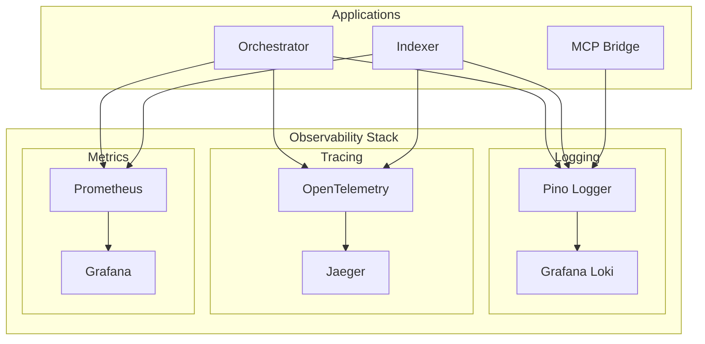

# OBSERVABILITY_SETUP.md

## Geliştirme Dokümanı - Observability (Logging, Tracing, Metrics)

**Sürüm:** 1.0  
**Tarih:** 5 Mart 2026  
**Hedef AI Agent:** Claude Sonnet 4.5  
**Öncelik:** YÜKSEK (Production Readiness)  
**Bağımlılık:** Tüm önceki geliştirme dokümanları

---

## 1. EKSİKLİK TESPİTİ VE DOĞRULAMA

### 1.1 Eksikliklerin Tanımı

| Eksiklik | Açıklama | Mevcut Durum |
|----------|----------|--------------|
| **Structured Logging** | JSON formatında loglama yok | Basit console.log |
| **Distributed Tracing** | OpenTelemetry entegrasyonu yok | Yok |
| **Prometheus Metrics** | Metrik toplama yok | Yok |
| **Log Aggregation** | Merkezi log toplama yok | Yok |
| **Alerting** | Otomatik uyarı sistemi yok | Yok |
| **Dashboard** | Görsel izleme paneli yok | Yok |

### 1.2 Eksikliklerin Konumları

| Dosya Yolu | Mevcut Durum | Gereken Durum |
|------------|--------------|---------------|
| `apps/orchestrator/src/server.ts` | Basit Fastify logger | Pino + OpenTelemetry |
| `apps/indexer/src/server.ts` | Basit logger | Pino + OpenTelemetry |
| `apps/orchestrator/src/observability/` | Temel Logger.ts | Kapsamlı observability |
| `apps/indexer/src/observability/` | Temel Logger.ts | Kapsamlı observability |
| `monitoring/` | Yok | Prometheus + Grafana |

### 1.3 Doğrulama Adımları

AI Agent, geliştirmeye başlamadan önce şu komutları çalıştırarak eksikliği doğrulamalıdır:

```bash
# 1. Mevcut logging implementasyonunu kontrol et
grep -rn "console.log\|console.error" apps/ | head -20

# 2. OpenTelemetry kullanımı kontrol et
grep -rn "opentelemetry\|@opentelemetry" apps/

# 3. Prometheus metrics kontrol et
grep -rn "prom-client\|prometheus" apps/

# 4. Mevcut observability dizinini incele
ls -la apps/orchestrator/src/observability/

# 5. Pino kullanımı kontrol et
grep -rn "pino" apps/
```

**Beklenen Bulgular:**
- `console.log` kullanımı yaygın
- OpenTelemetry paketi yok
- prom-client paketi yok
- Basit Logger sınıfı mevcut

---

## 2. OBSERVABILITY MİMARİSİ

### 2.1 Genel Yapı



### 2.2 Bileşen Sorumlulukları

| Bileşen | Kütüphane | Sorumluluk |
|---------|-----------|------------|
| Pino Logger | `pino` | Structured JSON logging |
| OpenTelemetry | `@opentelemetry/*` | Distributed tracing |
| Prometheus | `prom-client` | Metrics collection |
| Grafana | - | Visualization |
| Loki | - | Log aggregation |
| Jaeger | - | Trace visualization |

---

## 3. GELİŞTİRME TALİMATLARI

### 3.1 Adım 1: Structured Logging (Pino)

#### 3.1.1 Logger Factory

**Dosya:** `packages/shared-observability/src/logger.ts`

**Kod:**
```typescript
// packages/shared-observability/src/logger.ts

import pino, { Logger, LoggerOptions } from 'pino';

export interface LogContext {
  requestId?: string;
  runId?: string;
  userId?: string;
  sessionId?: string;
  service: string;
  version: string;
  environment: string;
}

export interface CreateLoggerOptions {
  service: string;
  version?: string;
  level?: string;
  prettyPrint?: boolean;
  context?: Partial<LogContext>;
}

const defaultContext: Partial<LogContext> = {
  service: 'unknown',
  version: process.env.npm_package_version || '0.0.0',
  environment: process.env.NODE_ENV || 'development',
};

export function createLogger(options: CreateLoggerOptions): Logger {
  const {
    service,
    version = defaultContext.version,
    level = process.env.LOG_LEVEL || 'info',
    prettyPrint = process.env.NODE_ENV !== 'production',
    context = {},
  } = options;

  const baseContext: LogContext = {
    ...defaultContext,
    service,
    version,
    ...context,
  };

  const pinoOptions: LoggerOptions = {
    level,
    base: baseContext,
    timestamp: pino.stdTimeFunctions.isoTime,
    formatters: {
      level: (label) => ({ level: label }),
      bindings: (bindings) => ({
        pid: bindings.pid,
        host: bindings.hostname,
      }),
    },
    serializers: {
      err: pino.stdSerializers.err,
      error: pino.stdSerializers.err,
      req: pino.stdSerializers.req,
      res: pino.stdSerializers.res,
    },
    redact: {
      paths: [
        'req.headers.authorization',
        'req.headers["x-api-key"]',
        'req.headers.cookie',
        '*.password',
        '*.apiKey',
        '*.secret',
        '*.token',
      ],
      censor: '[REDACTED]',
    },
  };

  // Pretty print for development
  if (prettyPrint) {
    return pino({
      ...pinoOptions,
      transport: {
        target: 'pino-pretty',
        options: {
          colorize: true,
          translateTime: 'SYS:standard',
          ignore: 'pid,hostname',
        },
      },
    });
  }

  return pino(pinoOptions);
}

/**
 * Request-scoped logger with context
 */
export class RequestContextLogger {
  private logger: Logger;
  private context: Record<string, any>;

  constructor(logger: Logger, context: Record<string, any> = {}) {
    this.logger = logger;
    this.context = context;
  }

  private log(level: string, message: string, data?: Record<string, any>) {
    this.logger[level]({ ...this.context, ...data }, message);
  }

  trace(message: string, data?: Record<string, any>) {
    this.log('trace', message, data);
  }

  debug(message: string, data?: Record<string, any>) {
    this.log('debug', message, data);
  }

  info(message: string, data?: Record<string, any>) {
    this.log('info', message, data);
  }

  warn(message: string, data?: Record<string, any>) {
    this.log('warn', message, data);
  }

  error(message: string, error?: Error, data?: Record<string, any>) {
    this.log('error', message, { error, ...data });
  }

  fatal(message: string, error?: Error, data?: Record<string, any>) {
    this.log('fatal', message, { error, ...data });
  }

  child(context: Record<string, any>): RequestContextLogger {
    return new RequestContextLogger(this.logger, { ...this.context, ...context });
  }

  withRequestId(requestId: string): RequestContextLogger {
    return this.child({ requestId });
  }

  withRunId(runId: string): RequestContextLogger {
    return this.child({ runId });
  }
}

// Singleton loggers for each service
let orchestratorLogger: Logger | null = null;
let indexerLogger: Logger | null = null;
let mcpBridgeLogger: Logger | null = null;

export function getOrchestratorLogger(): Logger {
  if (!orchestratorLogger) {
    orchestratorLogger = createLogger({ service: 'orchestrator' });
  }
  return orchestratorLogger;
}

export function getIndexerLogger(): Logger {
  if (!indexerLogger) {
    indexerLogger = createLogger({ service: 'indexer' });
  }
  return indexerLogger;
}

export function getMcpBridgeLogger(): Logger {
  if (!mcpBridgeLogger) {
    mcpBridgeLogger = createLogger({ service: 'mcp-bridge' });
  }
  return mcpBridgeLogger;
}
```

#### 3.1.2 Fastify Logging Integration

**Dosya:** `apps/orchestrator/src/middleware/logging.ts`

**Kod:**
```typescript
// apps/orchestrator/src/middleware/logging.ts

import { FastifyInstance, FastifyRequest, FastifyReply } from 'fastify';
import { getOrchestratorLogger, RequestContextLogger } from '@llm/shared-observability';

declare module 'fastify' {
  interface FastifyRequest {
    logContext: RequestContextLogger;
  }
}

export async function setupLogging(fastify: FastifyInstance) {
  const logger = getOrchestratorLogger();

  // Replace Fastify's default logger
  fastify.setLogger(logger as any);

  // Add request context logger
  fastify.addHook('onRequest', async (request: FastifyRequest, reply: FastifyReply) => {
    const requestId = request.id;
    const runId = request.headers['x-run-id'] as string | undefined;

    request.logContext = new RequestContextLogger(logger, {
      requestId,
      runId,
      method: request.method,
      url: request.url,
      ip: request.ip,
    });

    request.logContext.info('Request started');
  });

  // Log response
  fastify.addHook('onResponse', async (request: FastifyRequest, reply: FastifyReply) => {
    request.logContext.info('Request completed', {
      statusCode: reply.statusCode,
      responseTime: reply.elapsedTime,
    });
  });

  // Log errors
  fastify.addHook('onError', async (request: FastifyRequest, reply: FastifyReply, error: Error) => {
    request.logContext.error('Request error', error, {
      statusCode: reply.statusCode,
    });
  });

  fastify.log.info('Logging middleware configured');
}
```

### 3.2 Adım 2: OpenTelemetry Tracing

#### 3.2.1 Tracing Setup

**Dosya:** `packages/shared-observability/src/tracing.ts`

**Kod:**
```typescript
// packages/shared-observability/src/tracing.ts

import { NodeSDK } from '@opentelemetry/sdk-node';
import { OTLPTraceExporter } from '@opentelemetry/exporter-trace-otlp-grpc';
import { OTLPMetricExporter } from '@opentelemetry/exporter-metrics-otlp-grpc';
import { Resource } from '@opentelemetry/resources';
import { SemanticResourceAttributes } from '@opentelemetry/semantic-conventions';
import { BatchSpanProcessor } from '@opentelemetry/sdk-trace-base';
import { PeriodicExportingMetricReader } from '@opentelemetry/sdk-metrics';

export interface TracingConfig {
  serviceName: string;
  serviceVersion: string;
  otlpEndpoint?: string;
  samplingRatio?: number;
  enabled?: boolean;
}

let sdk: NodeSDK | null = null;

export function initializeTracing(config: TracingConfig): NodeSDK | null {
  const {
    serviceName,
    serviceVersion,
    otlpEndpoint = process.env.OTEL_EXPORTER_OTLP_ENDPOINT || 'http://localhost:4317',
    samplingRatio = parseFloat(process.env.OTEL_TRACES_SAMPLER_ARG || '1.0'),
    enabled = process.env.OTEL_ENABLED === 'true',
  } = config;

  if (!enabled) {
    console.info('OpenTelemetry tracing disabled');
    return null;
  }

  // Resource attributes
  const resource = new Resource({
    [SemanticResourceAttributes.SERVICE_NAME]: serviceName,
    [SemanticResourceAttributes.SERVICE_VERSION]: serviceVersion,
    [SemanticResourceAttributes.DEPLOYMENT_ENVIRONMENT]: process.env.NODE_ENV || 'development',
  });

  // Trace exporter
  const traceExporter = new OTLPTraceExporter({
    url: otlpEndpoint,
  });

  // Metric exporter
  const metricExporter = new OTLPMetricExporter({
    url: otlpEndpoint,
  });

  // Initialize SDK
  sdk = new NodeSDK({
    resource,
    spanProcessor: new BatchSpanProcessor(traceExporter),
    metricReader: new PeriodicExportingMetricReader({
      exporter: metricExporter,
      exportIntervalMillis: 60000,
    }),
  });

  // Start SDK
  sdk.start();

  console.info(`OpenTelemetry initialized for ${serviceName}`);

  // Graceful shutdown
  process.on('SIGTERM', async () => {
    if (sdk) {
      await sdk.shutdown();
      console.info('OpenTelemetry terminated');
    }
  });

  return sdk;
}

/**
 * Shutdown tracing
 */
export async function shutdownTracing(): Promise<void> {
  if (sdk) {
    await sdk.shutdown();
    sdk = null;
  }
}
```

#### 3.2.2 Fastify OpenTelemetry Integration

**Dosya:** `apps/orchestrator/src/middleware/tracing.ts`

**Kod:**
```typescript
// apps/orchestrator/src/middleware/tracing.ts

import { FastifyInstance, FastifyRequest, FastifyReply } from 'fastify';
import {
  trace,
  context,
  SpanStatusCode,
  Span,
  Context,
} from '@opentelemetry/api';
import { initializeTracing } from '@llm/shared-observability';

const tracer = trace.getTracer('orchestrator', '1.0.0');

export async function setupTracing(fastify: FastifyInstance) {
  // Initialize OpenTelemetry
  initializeTracing({
    serviceName: 'orchestrator',
    serviceVersion: process.env.npm_package_version || '0.1.0',
    enabled: process.env.OTEL_ENABLED === 'true',
  });

  // Add tracing middleware
  fastify.addHook('onRequest', async (request: FastifyRequest, reply: FastifyReply) => {
    const spanName = `${request.method} ${request.routeOptions?.url || request.url}`;
    
    const span = tracer.startSpan(spanName, {
      attributes: {
        'http.method': request.method,
        'http.url': request.url,
        'http.route': request.routeOptions?.url,
        'http.target': request.url,
        'http.host': request.headers.host,
        'http.scheme': request.protocol,
        'http.user_agent': request.headers['user-agent'],
        'net.peer.ip': request.ip,
      },
    });

    // Store span in request context
    request.span = span;
    request.tracingContext = context.active();
  });

  fastify.addHook('onResponse', async (request: FastifyRequest, reply: FastifyReply) => {
    const span = request.span as Span;
    if (span) {
      span.setAttributes({
        'http.status_code': reply.statusCode,
        'http.response_content_length': reply.payload?.length || 0,
      });
      span.end();
    }
  });

  fastify.addHook('onError', async (request: FastifyRequest, reply: FastifyReply, error: Error) => {
    const span = request.span as Span;
    if (span) {
      span.recordException(error);
      span.setStatus({
        code: SpanStatusCode.ERROR,
        message: error.message,
      });
    }
  });

  fastify.log.info('Tracing middleware configured');
}

// Extend Fastify types
declare module 'fastify' {
  interface FastifyRequest {
    span?: Span;
    tracingContext?: Context;
  }
}

/**
 * Helper to create child spans
 */
export function createChildSpan(
  name: string,
  parentSpan: Span,
  attributes?: Record<string, any>
): Span {
  return tracer.startSpan(name, {
    parent: parentSpan,
    attributes,
  });
}

/**
 * Trace async function execution
 */
export async function traceAsync<T>(
  name: string,
  fn: () => Promise<T>,
  parentSpan?: Span,
  attributes?: Record<string, any>
): Promise<T> {
  const span = tracer.startSpan(name, {
    parent: parentSpan,
    attributes,
  });

  try {
    const result = await fn();
    span.setStatus({ code: SpanStatusCode.OK });
    return result;
  } catch (error: any) {
    span.recordException(error);
    span.setStatus({
      code: SpanStatusCode.ERROR,
      message: error.message,
    });
    throw error;
  } finally {
    span.end();
  }
}
```

#### 3.2.3 Pipeline Tracing

**Dosya:** `apps/orchestrator/src/core/pipelineTracing.ts`

**Kod:**
```typescript
// apps/orchestrator/src/core/pipelineTracing.ts

import { trace, SpanStatusCode, Span } from '@opentelemetry/api';
import { traceAsync } from '../middleware/tracing';

const tracer = trace.getTracer('pipeline-engine', '1.0.0');

export class PipelineTracer {
  private runId: string;
  private rootSpan: Span;
  private currentSpan: Span;

  constructor(runId: string, parentSpan?: Span) {
    this.runId = runId;
    this.rootSpan = tracer.startSpan(`pipeline.run`, {
      attributes: {
        'pipeline.run_id': runId,
      },
    }, parentSpan ? trace.setSpan(context.active(), parentSpan) : undefined);
    this.currentSpan = this.rootSpan;
  }

  /**
   * Start a pipeline state span
   */
  startState(stateName: string): Span {
    const span = tracer.startSpan(`pipeline.state.${stateName}`, {
      parent: this.currentSpan,
      attributes: {
        'pipeline.state': stateName,
        'pipeline.run_id': this.runId,
      },
    });
    this.currentSpan = span;
    return span;
  }

  /**
   * End current state span
   */
  endState(span: Span, success: boolean = true): void {
    if (success) {
      span.setStatus({ code: SpanStatusCode.OK });
    } else {
      span.setStatus({ code: SpanStatusCode.ERROR });
    }
    span.end();
    this.currentSpan = this.rootSpan;
  }

  /**
   * Trace role execution
   */
  async traceRoleExecution(
    role: string,
    model: string,
    fn: () => Promise<any>
  ): Promise<any> {
    return traceAsync(
      `role.${role}.execute`,
      fn,
      this.currentSpan,
      {
        'role.name': role,
        'role.model': model,
      }
    );
  }

  /**
   * Trace model call
   */
  async traceModelCall(
    provider: string,
    model: string,
    fn: () => Promise<any>
  ): Promise<any> {
    return traceAsync(
      `model.${provider}.call`,
      fn,
      this.currentSpan,
      {
        'model.provider': provider,
        'model.name': model,
      }
    );
  }

  /**
   * Trace indexer call
   */
  async traceIndexerCall(
    operation: string,
    fn: () => Promise<any>
  ): Promise<any> {
    return traceAsync(
      `indexer.${operation}`,
      fn,
      this.currentSpan,
      {
        'indexer.operation': operation,
      }
    );
  }

  /**
   * Add event to current span
   */
  addEvent(name: string, attributes?: Record<string, any>): void {
    this.currentSpan.addEvent(name, attributes);
  }

  /**
   * Set error on root span
   */
  setError(error: Error): void {
    this.rootSpan.recordException(error);
    this.rootSpan.setStatus({
      code: SpanStatusCode.ERROR,
      message: error.message,
    });
  }

  /**
   * End root span
   */
  end(): void {
    this.rootSpan.end();
  }
}

// Import context for the tracer
import { context } from '@opentelemetry/api';
```

### 3.3 Adım 3: Prometheus Metrics

#### 3.3.1 Metrics Registry

**Dosya:** `packages/shared-observability/src/metrics.ts`

**Kod:**
```typescript
// packages/shared-observability/src/metrics.ts

import client, { Registry, Counter, Histogram, Gauge, Summary } from 'prom-client';

export interface MetricsConfig {
  serviceName: string;
  prefix?: string;
  defaultLabels?: Record<string, string>;
}

export class MetricsRegistry {
  private registry: Registry;
  private prefix: string;
  private defaultLabels: Record<string, string>;

  // Common metrics
  public httpRequestsTotal: Counter<string>;
  public httpRequestDuration: Histogram<string>;
  public httpRequestsInProgress: Gauge<string>;

  // LLM metrics
  public llmCallsTotal: Counter<string>;
  public llmCallDuration: Histogram<string>;
  public llmTokensTotal: Counter<string>;
  public llmErrorsTotal: Counter<string>;

  // Pipeline metrics
  public pipelineRunsTotal: Counter<string>;
  public pipelineDuration: Histogram<string>;
  public pipelineStepsTotal: Counter<string>;
  public pipelineStepDuration: Histogram<string>;

  // Indexer metrics
  public indexerOperationsTotal: Counter<string>;
  public indexerOperationDuration: Histogram<string>;
  public indexerDocumentsTotal: Gauge<string>;
  public indexerEmbeddingsTotal: Counter<string>;

  // Custom metrics storage
  private customMetrics: Map<string, client.Metric<string>> = new Map();

  constructor(config: MetricsConfig) {
    this.registry = new Registry();
    this.prefix = config.prefix || '';
    this.defaultLabels = config.defaultLabels || {
      service: config.serviceName,
    };

    // Apply default labels
    this.registry.setDefaultLabels(this.defaultLabels);

    // Initialize common metrics
    this.httpRequestsTotal = this.createCounter('http_requests_total', 'Total HTTP requests', ['method', 'path', 'status']);
    this.httpRequestDuration = this.createHistogram('http_request_duration_seconds', 'HTTP request duration', ['method', 'path'], [0.01, 0.05, 0.1, 0.5, 1, 2, 5, 10]);
    this.httpRequestsInProgress = this.createGauge('http_requests_in_progress', 'HTTP requests in progress', ['method', 'path']);

    // LLM metrics
    this.llmCallsTotal = this.createCounter('llm_calls_total', 'Total LLM API calls', ['provider', 'model', 'status']);
    this.llmCallDuration = this.createHistogram('llm_call_duration_seconds', 'LLM API call duration', ['provider', 'model'], [0.5, 1, 2, 5, 10, 30, 60, 120]);
    this.llmTokensTotal = this.createCounter('llm_tokens_total', 'Total LLM tokens used', ['provider', 'model', 'type']);
    this.llmErrorsTotal = this.createCounter('llm_errors_total', 'Total LLM errors', ['provider', 'error_type']);

    // Pipeline metrics
    this.pipelineRunsTotal = this.createCounter('pipeline_runs_total', 'Total pipeline runs', ['mode', 'status']);
    this.pipelineDuration = this.createHistogram('pipeline_duration_seconds', 'Pipeline execution duration', ['mode'], [5, 10, 30, 60, 120, 300]);
    this.pipelineStepsTotal = this.createCounter('pipeline_steps_total', 'Total pipeline steps executed', ['step', 'status']);
    this.pipelineStepDuration = this.createHistogram('pipeline_step_duration_seconds', 'Pipeline step duration', ['step'], [0.1, 0.5, 1, 5, 10, 30]);

    // Indexer metrics
    this.indexerOperationsTotal = this.createCounter('indexer_operations_total', 'Total indexer operations', ['operation', 'status']);
    this.indexerOperationDuration = this.createHistogram('indexer_operation_duration_seconds', 'Indexer operation duration', ['operation'], [0.1, 0.5, 1, 5, 10, 30]);
    this.indexerDocumentsTotal = this.createGauge('indexer_documents_total', 'Total indexed documents', []);
    this.indexerEmbeddingsTotal = this.createCounter('indexer_embeddings_total', 'Total embeddings generated', []);

    // Register default metrics
    client.collectDefaultMetrics({ register: this.registry });
  }

  // Factory methods
  createCounter(name: string, help: string, labelNames: string[] = []): Counter<string> {
    const metricName = this.getMetricName(name);
    const counter = new client.Counter({
      name: metricName,
      help,
      labelNames,
      registers: [this.registry],
    });
    this.customMetrics.set(metricName, counter);
    return counter;
  }

  createHistogram(name: string, help: string, labelNames: string[] = [], buckets?: number[]): Histogram<string> {
    const metricName = this.getMetricName(name);
    const histogram = new client.Histogram({
      name: metricName,
      help,
      labelNames,
      buckets,
      registers: [this.registry],
    });
    this.customMetrics.set(metricName, histogram);
    return histogram;
  }

  createGauge(name: string, help: string, labelNames: string[] = []): Gauge<string> {
    const metricName = this.getMetricName(name);
    const gauge = new client.Gauge({
      name: metricName,
      help,
      labelNames,
      registers: [this.registry],
    });
    this.customMetrics.set(metricName, gauge);
    return gauge;
  }

  createSummary(name: string, help: string, labelNames: string[] = []): Summary<string> {
    const metricName = this.getMetricName(name);
    const summary = new client.Summary({
      name: metricName,
      help,
      labelNames,
      registers: [this.registry],
    });
    this.customMetrics.set(metricName, summary);
    return summary;
  }

  private getMetricName(name: string): string {
    return this.prefix ? `${this.prefix}_${name}` : name;
  }

  /**
   * Get metrics output for Prometheus scraping
   */
  async getMetrics(): Promise<string> {
    return this.registry.metrics();
  }

  /**
   * Get content type
   */
  getContentType(): string {
    return this.registry.contentType;
  }

  /**
   * Clear all metrics (for testing)
   */
  clear(): void {
    this.registry.clear();
  }
}

// Singleton instances
let orchestratorMetrics: MetricsRegistry | null = null;
let indexerMetrics: MetricsRegistry | null = null;

export function getOrchestratorMetrics(): MetricsRegistry {
  if (!orchestratorMetrics) {
    orchestratorMetrics = new MetricsRegistry({
      serviceName: 'orchestrator',
      prefix: 'llm_council',
    });
  }
  return orchestratorMetrics;
}

export function getIndexerMetrics(): MetricsRegistry {
  if (!indexerMetrics) {
    indexerMetrics = new MetricsRegistry({
      serviceName: 'indexer',
      prefix: 'llm_council',
    });
  }
  return indexerMetrics;
}
```

#### 3.3.2 Fastify Metrics Integration

**Dosya:** `apps/orchestrator/src/middleware/metrics.ts`

**Kod:**
```typescript
// apps/orchestrator/src/middleware/metrics.ts

import { FastifyInstance, FastifyRequest, FastifyReply } from 'fastify';
import { getOrchestratorMetrics } from '@llm/shared-observability';

export async function setupMetrics(fastify: FastifyInstance) {
  const metrics = getOrchestratorMetrics();

  // Track HTTP requests
  fastify.addHook('onRequest', async (request: FastifyRequest, reply: FastifyReply) => {
    const path = request.routeOptions?.url || request.url;
    metrics.httpRequestsInProgress.labels(request.method, path).inc();
  });

  fastify.addHook('onResponse', async (request: FastifyRequest, reply: FastifyReply) => {
    const path = request.routeOptions?.url || request.url;
    const statusCode = reply.statusCode.toString();

    metrics.httpRequestsTotal.labels(request.method, path, statusCode).inc();
    metrics.httpRequestDuration.labels(request.method, path).observe(reply.elapsedTime / 1000);
    metrics.httpRequestsInProgress.labels(request.method, path).dec();
  });

  // Expose metrics endpoint
  fastify.get('/metrics', async (request, reply) => {
    const metricsOutput = await metrics.getMetrics();
    reply.type(metrics.getContentType());
    return metricsOutput;
  });

  fastify.log.info('Metrics middleware configured');
}

/**
 * Helper to track LLM calls
 */
export function trackLlmCall(
  provider: string,
  model: string,
  durationMs: number,
  tokens: { prompt: number; completion: number },
  success: boolean
) {
  const metrics = getOrchestratorMetrics();

  metrics.llmCallsTotal.labels(provider, model, success ? 'success' : 'error').inc();
  metrics.llmCallDuration.labels(provider, model).observe(durationMs / 1000);
  metrics.llmTokensTotal.labels(provider, model, 'prompt').inc(tokens.prompt);
  metrics.llmTokensTotal.labels(provider, model, 'completion').inc(tokens.completion);
}

/**
 * Helper to track pipeline runs
 */
export function trackPipelineRun(
  mode: string,
  durationMs: number,
  success: boolean
) {
  const metrics = getOrchestratorMetrics();

  metrics.pipelineRunsTotal.labels(mode, success ? 'success' : 'error').inc();
  metrics.pipelineDuration.labels(mode).observe(durationMs / 1000);
}

/**
 * Helper to track pipeline steps
 */
export function trackPipelineStep(
  step: string,
  durationMs: number,
  success: boolean
) {
  const metrics = getOrchestratorMetrics();

  metrics.pipelineStepsTotal.labels(step, success ? 'success' : 'error').inc();
  metrics.pipelineStepDuration.labels(step).observe(durationMs / 1000);
}
```

### 3.4 Adım 4: Health Check Enhancement

**Dosya:** `apps/orchestrator/src/api/HealthController.ts`

**Kod:**
```typescript
// apps/orchestrator/src/api/HealthController.ts

import { FastifyRequest, FastifyReply } from 'fastify';
import axios from 'axios';
import { getOrchestratorMetrics } from '@llm/shared-observability';

interface HealthCheckResult {
  name: string;
  status: 'healthy' | 'unhealthy' | 'degraded';
  latency?: number;
  message?: string;
  details?: Record<string, any>;
}

export const HealthController = {
  /**
   * Basic health check
   */
  async health(request: FastifyRequest, reply: FastifyReply) {
    return {
      status: 'ok',
      timestamp: Date.now(),
      version: process.env.npm_package_version || '0.1.0',
    };
  },

  /**
   * Liveness probe
   */
  async liveness(request: FastifyRequest, reply: FastifyReply) {
    return { status: 'alive' };
  },

  /**
   * Readiness probe
   */
  async readiness(request: FastifyRequest, reply: FastifyReply) {
    const checks = await Promise.allSettled([
      checkIndexer(),
      checkQdrant(),
      checkEmbeddingServer(),
    ]);

    const results = checks.map((check, index) => {
      const names = ['indexer', 'qdrant', 'embedding'];
      if (check.status === 'fulfilled') {
        return check.value;
      } else {
        return {
          name: names[index],
          status: 'unhealthy' as const,
          message: check.reason?.message || 'Unknown error',
        };
      }
    });

    const allHealthy = results.every((r) => r.status === 'healthy');
    const anyDegraded = results.some((r) => r.status === 'degraded');

    const overallStatus = allHealthy ? 'healthy' : anyDegraded ? 'degraded' : 'unhealthy';

    return {
      status: overallStatus,
      timestamp: Date.now(),
      checks: results.reduce((acc, check) => {
        acc[check.name] = {
          status: check.status,
          latency: check.latency,
          message: check.message,
        };
        return acc;
      }, {} as Record<string, any>),
    };
  },

  /**
   * Detailed health with metrics
   */
  async detailed(request: FastifyRequest, reply: FastifyReply) {
    const metrics = getOrchestratorMetrics();

    const checks = await Promise.allSettled([
      checkIndexer(),
      checkQdrant(),
      checkEmbeddingServer(),
      checkLLMProviders(),
    ]);

    const results = checks.map((check) =>
      check.status === 'fulfilled' ? check.value : { status: 'unhealthy', message: check.reason?.message }
    );

    // Get current metrics snapshot
    const metricsSnapshot = {
      pipelines: {
        total: 0, // Would come from metrics registry
        successful: 0,
        failed: 0,
      },
      llm: {
        totalCalls: 0,
        totalTokens: 0,
        avgLatency: 0,
      },
      memory: {
        heapUsed: process.memoryUsage().heapUsed,
        heapTotal: process.memoryUsage().heapTotal,
        rss: process.memoryUsage().rss,
      },
      uptime: process.uptime(),
    };

    return {
      status: results.every((r) => r.status === 'healthy') ? 'healthy' : 'degraded',
      timestamp: Date.now(),
      version: process.env.npm_package_version || '0.1.0',
      checks: results,
      metrics: metricsSnapshot,
    };
  },
};

// Helper functions
async function checkIndexer(): Promise<HealthCheckResult> {
  const start = Date.now();
  try {
    const response = await axios.get(`${process.env.INDEXER_URL}/health`, {
      timeout: 5000,
    });
    return {
      name: 'indexer',
      status: 'healthy',
      latency: Date.now() - start,
      details: response.data,
    };
  } catch (error: any) {
    return {
      name: 'indexer',
      status: 'unhealthy',
      latency: Date.now() - start,
      message: error.message,
    };
  }
}

async function checkQdrant(): Promise<HealthCheckResult> {
  const start = Date.now();
  try {
    const response = await axios.get(`${process.env.QDRANT_URL}/readyz`, {
      timeout: 5000,
    });
    return {
      name: 'qdrant',
      status: 'healthy',
      latency: Date.now() - start,
    };
  } catch (error: any) {
    return {
      name: 'qdrant',
      status: 'unhealthy',
      latency: Date.now() - start,
      message: error.message,
    };
  }
}

async function checkEmbeddingServer(): Promise<HealthCheckResult> {
  const start = Date.now();
  try {
    const response = await axios.get(`${process.env.EMBEDDING_URL}/health`, {
      timeout: 5000,
    });
    return {
      name: 'embedding',
      status: 'healthy',
      latency: Date.now() - start,
    };
  } catch (error: any) {
    return {
      name: 'embedding',
      status: 'unhealthy',
      latency: Date.now() - start,
      message: error.message,
    };
  }
}

async function checkLLMProviders(): Promise<HealthCheckResult> {
  // Check if API keys are configured
  const providers = {
    openai: !!process.env.OPENAI_API_KEY,
    anthropic: !!process.env.ANTHROPIC_API_KEY,
    zai: !!process.env.ZAI_API_KEY,
    gemini: !!process.env.GEMINI_API_KEY,
  };

  const availableCount = Object.values(providers).filter(Boolean).length;

  return {
    name: 'llm_providers',
    status: availableCount >= 2 ? 'healthy' : 'degraded',
    message: `${availableCount} providers available`,
    details: providers,
  };
}
```

### 3.5 Adım 5: Docker Compose Observability Stack

**Dosya:** `docker-compose.observability.yml`

**Kod:**
```yaml
# docker-compose.observability.yml
# Observability stack for LLM Council Orchestrator

version: '3.8'

services:
  # Prometheus - Metrics collection
  prometheus:
    image: prom/prometheus:v2.48.0
    container_name: llm_council_prometheus
    ports:
      - "9090:9090"
    volumes:
      - ./monitoring/prometheus.yml:/etc/prometheus/prometheus.yml:ro
      - prometheus_data:/prometheus
    command:
      - '--config.file=/etc/prometheus/prometheus.yml'
      - '--storage.tsdb.path=/prometheus'
      - '--web.enable-lifecycle'
    networks:
      - llm-council
    restart: unless-stopped

  # Grafana - Visualization
  grafana:
    image: grafana/grafana:10.2.0
    container_name: llm_council_grafana
    ports:
      - "3000:3000"
    environment:
      - GF_SECURITY_ADMIN_USER=admin
      - GF_SECURITY_ADMIN_PASSWORD=admin
      - GF_USERS_ALLOW_SIGN_UP=false
    volumes:
      - grafana_data:/var/lib/grafana
      - ./monitoring/grafana/provisioning:/etc/grafana/provisioning:ro
      - ./monitoring/grafana/dashboards:/var/lib/grafana/dashboards:ro
    depends_on:
      - prometheus
      - loki
    networks:
      - llm-council
    restart: unless-stopped

  # Loki - Log aggregation
  loki:
    image: grafana/loki:2.9.0
    container_name: llm_council_loki
    ports:
      - "3100:3100"
    volumes:
      - ./monitoring/loki.yml:/etc/loki/local-config.yaml:ro
      - loki_data:/loki
    command: -config.file=/etc/loki/local-config.yaml
    networks:
      - llm-council
    restart: unless-stopped

  # Promtail - Log shipping
  promtail:
    image: grafana/promtail:2.9.0
    container_name: llm_council_promtail
    volumes:
      - ./monitoring/promtail.yml:/etc/promtail/config.yml:ro
      - /var/log:/var/log:ro
      - ./logs:/app/logs:ro
    command: -config.file=/etc/promtail/config.yml
    depends_on:
      - loki
    networks:
      - llm-council
    restart: unless-stopped

  # Jaeger - Distributed tracing
  jaeger:
    image: jaegertracing/all-in-one:1.51
    container_name: llm_council_jaeger
    ports:
      - "16686:16686"  # UI
      - "4317:4317"    # OTLP gRPC
      - "4318:4318"    # OTLP HTTP
    environment:
      - COLLECTOR_OTLP_ENABLED=true
    networks:
      - llm-council
    restart: unless-stopped

  # Alertmanager - Alerting
  alertmanager:
    image: prom/alertmanager:v0.26.0
    container_name: llm_council_alertmanager
    ports:
      - "9093:9093"
    volumes:
      - ./monitoring/alertmanager.yml:/etc/alertmanager/alertmanager.yml:ro
      - alertmanager_data:/alertmanager
    command:
      - '--config.file=/etc/alertmanager/alertmanager.yml'
      - '--storage.path=/alertmanager'
    networks:
      - llm-council
    restart: unless-stopped

volumes:
  prometheus_data:
  grafana_data:
  loki_data:
  alertmanager_data:

networks:
  llm-council:
    external: true
```

### 3.6 Adım 6: Prometheus Configuration

**Dosya:** `monitoring/prometheus.yml`

**Kod:**
```yaml
# monitoring/prometheus.yml

global:
  scrape_interval: 15s
  evaluation_interval: 15s

alerting:
  alertmanagers:
    - static_configs:
        - targets:
          - alertmanager:9093

rule_files:
  - /etc/prometheus/alert_rules.yml

scrape_configs:
  # Orchestrator metrics
  - job_name: 'orchestrator'
    static_configs:
      - targets: ['orchestrator:7001']
    metrics_path: '/metrics'

  # Indexer metrics
  - job_name: 'indexer'
    static_configs:
      - targets: ['indexer:9001']
    metrics_path: '/metrics'

  # Prometheus self-monitoring
  - job_name: 'prometheus'
    static_configs:
      - targets: ['localhost:9090']

  # Qdrant metrics
  - job_name: 'qdrant'
    static_configs:
      - targets: ['qdrant:6333']
    metrics_path: '/metrics'
```

### 3.7 Adım 7: Alert Rules

**Dosya:** `monitoring/alert_rules.yml`

**Kod:**
```yaml
# monitoring/alert_rules.yml

groups:
  - name: llm_council_orchestrator
    rules:
      # High error rate
      - alert: HighErrorRate
        expr: rate(llm_council_http_requests_total{status=~"5.."}[5m]) > 0.1
        for: 5m
        labels:
          severity: critical
        annotations:
          summary: "High error rate detected"
          description: "Error rate is {{ $value }} requests/s"

      # LLM provider unavailable
      - alert: LLMProviderUnavailable
        expr: up{job="orchestrator"} == 0
        for: 1m
        labels:
          severity: critical
        annotations:
          summary: "LLM provider unavailable"
          description: "{{ $labels.instance }} is down"

      # High latency
      - alert: HighLatency
        expr: histogram_quantile(0.95, rate(llm_council_http_request_duration_seconds_bucket[5m])) > 2
        for: 5m
        labels:
          severity: warning
        annotations:
          summary: "High latency detected"
          description: "95th percentile latency is {{ $value }}s"

      # Pipeline failures
      - alert: PipelineFailures
        expr: rate(llm_council_pipeline_runs_total{status="error"}[10m]) > 0.05
        for: 5m
        labels:
          severity: warning
        annotations:
          summary: "High pipeline failure rate"
          description: "Pipeline failure rate is {{ $value }} runs/s"

      # Memory usage
      - alert: HighMemoryUsage
        expr: (node_memory_MemTotal_bytes - node_memory_MemAvailable_bytes) / node_memory_MemTotal_bytes > 0.9
        for: 5m
        labels:
          severity: critical
        annotations:
          summary: "High memory usage"
          description: "Memory usage is {{ $value | humanizePercentage }}"

      # Indexer queue backup
      - alert: IndexerQueueBackup
        expr: llm_council_indexer_operations_in_progress > 100
        for: 5m
        labels:
          severity: warning
        annotations:
          summary: "Indexer queue backing up"
          description: "{{ $value }} operations in progress"
```

---

## 4. TEST SENARYOLARI

### 4.1 Logging Tests

```typescript
// packages/shared-observability/src/__tests__/logger.test.ts

import { describe, it, expect, beforeEach } from 'vitest';
import { createLogger, RequestContextLogger } from '../logger';
import pino from 'pino';

describe('Logger', () => {
  describe('createLogger', () => {
    it('should create logger with correct context', () => {
      const logger = createLogger({ service: 'test-service' });
      expect(logger).toBeDefined();
    });

    it('should include service name in logs', async () => {
      const logs: any[] = [];
      const logger = pino({
        base: { service: 'test' }
      }, {
        write: (data) => logs.push(JSON.parse(data))
      });

      logger.info('Test message');

      expect(logs[0]).toHaveProperty('service', 'test');
    });
  });

  describe('RequestContextLogger', () => {
    it('should include context in all log messages', () => {
      const logs: any[] = [];
      const baseLogger = pino({}, { write: (data) => logs.push(JSON.parse(data)) });
      
      const contextLogger = new RequestContextLogger(baseLogger, { requestId: 'test-123' });
      contextLogger.info('Test message');

      expect(logs[0]).toHaveProperty('requestId', 'test-123');
    });
  });
});
```

### 4.2 Metrics Tests

```typescript
// packages/shared-observability/src/__tests__/metrics.test.ts

import { describe, it, expect, beforeEach } from 'vitest';
import { MetricsRegistry } from '../metrics';

describe('MetricsRegistry', () => {
  let registry: MetricsRegistry;

  beforeEach(() => {
    registry = new MetricsRegistry({
      serviceName: 'test',
      prefix: 'test_prefix',
    });
  });

  it('should create counter metrics', () => {
    const counter = registry.createCounter('test_counter', 'Test counter');
    counter.inc();
    expect(counter).toBeDefined();
  });

  it('should create histogram metrics', () => {
    const histogram = registry.createHistogram('test_histogram', 'Test histogram');
    histogram.observe(0.5);
    expect(histogram).toBeDefined();
  });

  it('should generate Prometheus output', async () => {
    registry.httpRequestsTotal.labels('GET', '/test', '200').inc();
    
    const output = await registry.getMetrics();
    expect(output).toContain('http_requests_total');
  });
});
```

---

## 5. DOĞRULAMA KRİTERLERİ

### 5.1 Fonksiyonel Doğrulama

```bash
# 1. Prometheus metrics endpoint
curl http://localhost:7001/metrics

# Beklenen: Prometheus formatında metrikler

# 2. Health check
curl http://localhost:7001/health/detailed

# Beklenen: JSON formatında sağlık durumu

# 3. Grafana dashboard
open http://localhost:3000

# Beklenen: Grafana login sayfası

# 4. Jaeger UI
open http://localhost:16686

# Beklenen: Jaeger tracing UI
```

### 5.2 Log Aggregation Doğrulama

```bash
# Loki query
curl -G 'http://localhost:3100/loki/api/v1/query' \
  --data-urlencode 'query={service="orchestrator"}'

# Beklenen: Log entries
```

---

## 6. BAĞIMLILIKLAR

### 6.1 npm Paketleri

```json
{
  "dependencies": {
    "pino": "^8.17.0",
    "pino-pretty": "^10.3.0",
    "@opentelemetry/api": "^1.7.0",
    "@opentelemetry/sdk-node": "^0.45.0",
    "@opentelemetry/exporter-trace-otlp-grpc": "^0.45.0",
    "@opentelemetry/exporter-metrics-otlp-grpc": "^0.45.0",
    "prom-client": "^15.1.0"
  }
}
```

---

## 7. SONUÇ

Bu doküman tamamlandığında LLM Council Orchestrator aşağıdaki observability yeteneklerine sahip olacak:

| Yetenek | Araç | Durum |
|---------|------|-------|
| Structured Logging | Pino | ✅ |
| Log Aggregation | Loki | ✅ |
| Distributed Tracing | OpenTelemetry + Jaeger | ✅ |
| Metrics Collection | Prometheus | ✅ |
| Visualization | Grafana | ✅ |
| Alerting | Alertmanager | ✅ |

---

**Doküman Sahibi:** GLM-5 Architect Mode  
**Son Güncelleme:** 5 Mart 2026  
**Durum:** GELİŞTİRMEYE HAZIR
