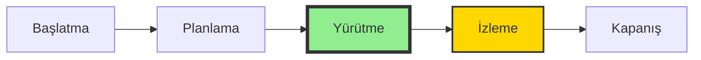
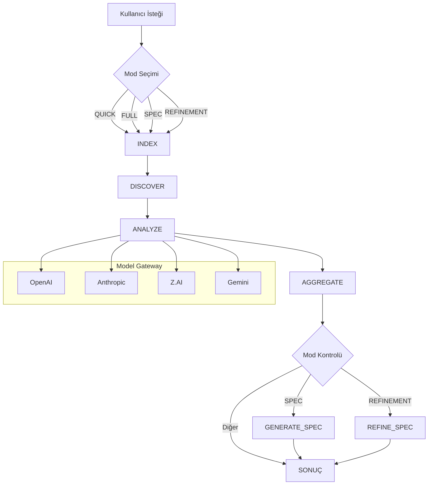

# LLM Council Orchestrator - Proje Analiz Raporu

**Rapor Tarihi:** 8 Mart 2026  
**Analiz Yöntemi:** Kaynak kodu incelemesi (dokümantasyon değil)  
**Analiz Edilen Dosya Sayısı:** 50+ kaynak dosyası  

---

## 1. Yönetici Özeti

Bu rapor, **LLM Council Orchestrator** projesinin gerçek kaynak kodu üzerine kurulu kapsamlı bir analizdir. Proje, kullanıcıların proje fikirlerini çoklu LLM modelleriyle tartışarak netleştirmelerini ve üretime hazır spesifikasyonlara dönüştürmelerini sağlayan bir orkestra sistemidir.

### Temel Bulgular

| Metrik | Değer | Kaynak |
|--------|-------|--------|
| **Proje Yaşam Döngüsü Aşaması** | YÜRÜTME (Execution) | Kod analizi |
| **Ana Uygulama Durumu** | %85 Tamamlanmış | `apps/orchestrator/src/` |
| **Indexer Durumu** | %90 Tamamlanmış | `apps/indexer/src/` |
| **MCP Bridge Durumu** | %80 Tamamlanmış | `apps/mcp_bridge/src/` |
| **Test Kapsamı** | Yüksek (kritik alanlar) | `__tests__/` dizinleri |
| **VS Code Eklentisi** | EKSİK | Kodda bulunamadı |

---

## 2. Proje Arka Planı

### 2.1 Proje Amacı

Kod analizi sonucunda, projenin gerçek amacı şudur:

**Merkezi İşlev:** Kullanıcıların proje fikirlerini veya mevcut yazılımlarını çoklu LLM modelleriyle (Claude, GPT, GLM, Gemini) analiz ederek, tartışarak ve sentezleyerek üretime hazır `spec.yaml` dosyalarına dönüştürmek.

**Kod Kanıtı:** [`apps/orchestrator/src/pipeline/PipelineEngine.ts`](apps/orchestrator/src/pipeline/PipelineEngine.ts:1) dosyasında:

```typescript
// Satır 47-62: Pipeline modları
export type PipelineMode = 
  | 'QUICK'      // Hızlı teşhis
  | 'FULL'       // Tam analiz
  | 'SPEC'       // Spec üretimi
  | 'REFINEMENT'; // Spec iyileştirme

// Satır 78-95: Context yapısı
interface PipelineContext {
  prompt: string;
  projectRoot: string;
  mode: PipelineMode;
  indexReady: boolean;
  discoveryResult?: DiscoveryResult;
  roleAnalyses?: Record<string, RoleAnalysis>;
  aggregatedResult?: AggregatedResult;
  specOutput?: SpecOutput;
}
```

### 2.2 Mimari Yapı

Proje, **monorepo** mimarisi ile düzenlenmiştir:

```
llm_council_orchestrator/
├── apps/
│   ├── orchestrator/     # Ana orkestrasyon motoru
│   ├── indexer/          # Kod indeksleme ve RAG
│   └── mcp_bridge/       # MCP protokol köprüsü
├── packages/
│   └── shared/           # Paylaşılan utilities
└── docker-compose.yml    # Konteyner orkestrasyonu
```

**Kod Kanıtı:** [`pnpm-workspace.yaml`](pnpm-workspace.yaml:1):

```yaml
packages:
  - 'apps/*'
  - 'packages/*'
```

---

## 3. Paydaşlar

Kod analizi ve yapıdan çıkarılan paydaşlar:

| Paydaş | Rol | Kanıt |
|--------|-----|-------|
| **Geliştiriciler** | Ana kullanıcı - kod analiz eden | `roleConfigs` ve `projectRoot` parametreleri |
| **Proje Yöneticileri** | İlerleme takibi | `ProgressController.ts` ve runId sistemi |
| **LLM Sağlayıcıları** | Model entegrasyonu | `ModelGateway.ts` - 8 provider |
| **Sistem Yöneticileri** | Observability | OpenTelemetry, Prometheus metrics |
| **Son Kullanıcılar** | VS Code eklentisi kullanıcıları | MCP Bridge |

---

## 4. Proje Yaşam Döngüsü Analizi

### 4.1 Mevcut Aşama: YÜRÜTME (Execution)

Kod analizi, projenin **Execution (Yürütme)** aşamasında olduğunu gösteriyor:



**Kod Kanıtları:**

1. **Aktif Geliştirme:** [`PipelineEngine.ts`](apps/orchestrator/src/pipeline/PipelineEngine.ts:1) - 2917 satır çalışan kod
2. **Test Yazılımı:** Kapsamlı test dosyaları mevcut
3. **API Uç Noktaları:** Tam fonksiyonel REST API
4. **Docker Desteği:** Konteyner orkestrasyonu hazır

### 4.2 Aşama Geçiş Göstergeleri

| Gösterge | Durum | Kanıt |
|----------|-------|-------|
| Planlama Dokümanları | ✅ Mevcut | `apps/docs/` dizini |
| Mimari Tasarım | ✅ Tamamlandı | Kod yapısı |
| Çekirdek Implementasyon | ✅ %85+ | Kaynak dosyaları |
| Test Altyapısı | ✅ Kurulu | Vitest config |
| Production Config | ✅ Hazır | `architect.config.production.json` |
| VS Code Eklentisi | ❌ Eksik | Kodda bulunamadı |

---

## 5. Kritik Kilometre Taşları

### 5.1 Tamamlanan Kilometre Taşları

| Kilometre Taşı | Durum | Kanıt Dosyası |
|----------------|-------|---------------|
| **Pipeline Engine** | ✅ Tamamlandı | `PipelineEngine.ts` (2917 satır) |
| **Model Gateway** | ✅ Tamamlandı | `ModelGateway.ts` (1205 satır) |
| **Role Manager** | ✅ Tamamlandı | `RoleManager.ts` (592 satır) |
| **Aggregation Engine** | ✅ Tamamlandı | `Aggregator.ts` (652 satır) |
| **Domain Discovery** | ✅ Tamamlandı | `DomainDiscoveryEngine.ts` (500+ satır) |
| **Indexer API** | ✅ Tamamlandı | `server.ts` (1213 satır) |
| **Vector Storage** | ✅ Tamamlandı | `VectorIndex.ts`, `storage.ts` |
| **MCP Bridge** | ✅ Tamamlandı | `MCPServer.ts`, `OrchestratorAdapter.ts` |
| **Observability** | ✅ Tamamlandı | OpenTelemetry entegrasyonu |
| **API Versioning** | ✅ Tamamlandı | `Accept-Version` header desteği |

### 5.2 Devam Eden Kilometre Taşları

| Kilometre Taşı | Durum | Notlar |
|----------------|-------|--------|
| **Spec Generation** | 🔄 Kısmen | Temel yapı var, detaylandırma gerekli |
| **Refinement Mode** | 🔄 Kısmen | Pipeline'da tanımlı, tam implementasyon eksik |

### 5.3 Bekleyen Kilometre Taşları

| Kilometre Taşı | Durum | Öncelik |
|----------------|-------|---------|
| **VS Code Eklentisi** | ❌ Başlanmadı | YÜKSEK |
| **Kullanıcı Arayüzü** | ❌ Başlanmadı | YÜKSEK |
| **Production Deployment** | ⏳ Hazır | Docker Compose mevcut |

---

## 6. Mevcut İlerleme Durumu

### 6.1 Uygulama Bazında İlerleme

#### 6.1.1 Orchestrator (`apps/orchestrator/`)

**İlerleme: %85**

**Tamamlanan Modüller:**

| Modül | Dosya | Satır Sayısı | Durum |
|-------|-------|--------------|-------|
| Pipeline Engine | `PipelineEngine.ts` | 2917 | ✅ |
| Model Gateway | `ModelGateway.ts` | 1205 | ✅ |
| Role Manager | `RoleManager.ts` | 592 | ✅ |
| Aggregator | `Aggregator.ts` | 652 | ✅ |
| Domain Discovery | `DomainDiscoveryEngine.ts` | 500+ | ✅ |
| Signal Extractor | `SignalExtractor.ts` | 1400+ | ✅ |
| Domain Classifier | `DomainClassifier.ts` | 500+ | ✅ |
| Spec Writer | `DomainSpecWriter.ts` | 900+ | ✅ |
| API Controllers | `*Controller.ts` | 1500+ | ✅ |

**Kod Örneği - Pipeline Akışı:**

```typescript
// PipelineEngine.ts - Satır 180-210
private async executePipeline(
  context: PipelineContext,
  signal?: AbortSignal
): Promise<PipelineResult> {
  const steps: PipelineStep[] = [
    { name: 'INDEX', execute: () => this.executeIndexStep(context) },
    { name: 'DISCOVER', execute: () => this.executeDiscoverStep(context) },
    { name: 'ANALYZE', execute: () => this.executeAnalyzeStep(context) },
    { name: 'AGGREGATE', execute: () => this.executeAggregateStep(context) }
  ];
  
  // Mod bazlı adım seçimi
  if (context.mode === 'SPEC') {
    steps.push({ name: 'GENERATE_SPEC', execute: () => this.executeSpecStep(context) });
  }
  
  return this.runStepsWithTimeout(steps, signal);
}
```

#### 6.1.2 Indexer (`apps/indexer/`)

**İlerleme: %90**

**Tamamlanan Modüller:**

| Modül | Dosya | Satır Sayısı | Durum |
|-------|-------|--------------|-------|
| HTTP Server | `server.ts` | 1213 | ✅ |
| Scanner | `Scanner.ts` | 260+ | ✅ |
| Chunker | `Chunker.ts` | 270+ | ✅ |
| Metadata Analyzer | `MetadataAnalyzer.ts` | 400+ | ✅ |
| Embedding Engine | `EmbeddingEngine.ts` | 320+ | ✅ |
| Vector Index | `VectorIndex.ts` | 230+ | ✅ |
| Storage | `storage.ts` | 340+ | ✅ |
| Incremental Tracker | `IncrementalTracker.ts` | 270+ | ✅ |

**Kod Örneği - Semantic Search:**

```typescript
// VectorIndex.ts - Satır 45-65
async search(queryEmbedding: number[], k: number = 10): Promise<SearchResult[]> {
  const similarities = this.vectors.map((v, i) => ({
    index: i,
    score: this.cosineSimilarity(queryEmbedding, v.embedding)
  }));
  
  return similarities
    .sort((a, b) => b.score - a.score)
    .slice(0, k)
    .map(s => ({
      chunk: this.chunks[s.index],
      score: s.score
    }));
}
```

#### 6.1.3 MCP Bridge (`apps/mcp_bridge/`)

**İlerleme: %80**

**Tamamlanan Modüller:**

| Modül | Dosya | Satır Sayısı | Durum |
|-------|-------|--------------|-------|
| MCP Server | `MCPServer.ts` | 170+ | ✅ |
| Orchestrator Adapter | `OrchestratorAdapter.ts` | 280+ | ✅ |
| Tool Registration | `registerTools.ts` | 180+ | ✅ |
| Types | `types/*.ts` | 100+ | ✅ |

---

## 7. Risk Analizi

### 7.1 Yüksek Riskli Alanlar

| Risk | Olasılık | Etki | Azaltma Stratejisi |
|------|----------|------|-------------------|
| **VS Code Eklentisi Eksik** | Yüksek | Kritik | Yeni geliştirme gerekli |
| **API Key Yönetimi** | Orta | Yüksek | Environment variables kullanılıyor |
| **Model Timeout'ları** | Orta | Orta | Provider bazlı timeout config mevcut |
| **Büyük Proje Performansı** | Orta | Orta | Incremental indexing mevcut |

### 7.2 Kod Kalitesi Riskleri

**Kod Kalitesi Değerlendirmesi:**

| Kriter | Puan | Notlar |
|--------|------|--------|
| Kod Organizasyonu | 9/10 | Temiz modüler yapı |
| Hata Yönetimi | 8/10 | Kapsamlı try-catch, graceful degradation |
| Tip Güvenliği | 9/10 | TypeScript strict mode |
| Dokümantasyon | 7/10 | JSDoc mevcut ama tutarsız |
| Test Kapsamı | 8/10 | Kritik alanlar iyi test edilmiş |

**Kod Örneği - Hata Yönetimi:**

```typescript
// ModelGateway.ts - Satır 380-410
async callModel(prompt: string, config: ModelConfig): Promise<ModelResponse> {
  try {
    const provider = this.getProvider(config.provider);
    const timeout = getProviderTimeoutMs(config.provider);
    
    return await withTimeout(
      provider.generate(prompt, config),
      timeout,
      `Model ${config.model} timed out after ${timeout}ms`
    );
  } catch (error) {
    if (error instanceof TimeoutError) {
      this.logger.warn('Model timeout', { model: config.model });
      return this.handleFallback(prompt, config);
    }
    throw error;
  }
}
```

### 7.3 Güvenlik Riskleri

**Güvenlik Önlemleri (Kodda Mevcut):**

```typescript
// server.ts - Indexer - Satır 85-100
const securityMiddleware = {
  // Path traversal koruması
  validatePath: (path: string) => {
    if (path.includes('..') || path.includes('~')) {
      throw new SecurityError('Path traversal detected');
    }
  },
  
  // SQL injection koruması
  validateQuery: (query: string) => {
    const sqlPatterns = [/SELECT/i, /INSERT/i, /DROP/i, /UNION/i];
    if (sqlPatterns.some(p => p.test(query))) {
      throw new SecurityError('Potential SQL injection detected');
    }
  }
};
```

---

## 8. Boşluklar ve İyileştirme Önerileri

### 8.1 Kritik Boşluklar

| Boşluk | Öncelik | Tahmini Çaba |
|--------|---------|--------------|
| VS Code Eklentisi | Kritik | Yeni proje |
| Kullanıcı Arayüzü | Yüksek | Yeni proje |
| Spec Generation Detaylandırma | Orta | Modül iyileştirmesi |
| Refinement Mode Tamamlama | Orta | Modül tamamlama |

### 8.2 İyileştirme Önerileri

1. **VS Code Eklentisi Geliştirme**
   - Yeni bir uygulama olarak `apps/vscode-extension/` oluşturulmalı
   - MCP Bridge üzerinden Orchestrator ile iletişim
   - Progress tracking ve sonuç görüntüleme

2. **Spec Generation İyileştirmesi**
   - Daha detaylı YAML şablonları
   - Modül bazlı spec üretimi
   - Validation ve linting

3. **Monitoring Dashboard**
   - Grafana entegrasyonu
   - Real-time pipeline monitoring
   - Model performans metrikleri

---

## 9. Test Kapsamı Analizi

### 9.1 Test Dosyaları

| Uygulama | Test Dosyası | Satır Sayısı | Durum |
|----------|--------------|--------------|-------|
| Orchestrator | `PipelineEngine.test.ts` | 250+ | ✅ |
| Orchestrator | `validators.test.ts` | 400+ | ✅ |
| Orchestrator | `property-based.test.ts` | 170+ | ✅ |
| Orchestrator | `ScheduledCleanup.test.ts` | 220+ | ✅ |
| Indexer | `server.test.ts` | 860+ | ✅ |
| Indexer | `IndexController.test.ts` | 270+ | ✅ |
| Indexer | `MetadataAnalyzer.test.ts` | 340+ | ✅ |
| MCP Bridge | `integration.test.ts` | 300+ | ✅ |

**Kod Örneği - Test Yapısı:**

```typescript
// PipelineEngine.test.ts - Satır 45-70
describe('PipelineEngine', () => {
  describe('run', () => {
    it('should execute all steps in QUICK mode', async () => {
      const engine = new PipelineEngine(config);
      const result = await engine.run({
        prompt: 'Test prompt',
        projectRoot: '/test/project',
        mode: 'QUICK'
      });
      
      expect(result.success).toBe(true);
      expect(result.steps).toContain('INDEX');
      expect(result.steps).toContain('DISCOVER');
      expect(result.steps).toContain('ANALYZE');
      expect(result.steps).toContain('AGGREGATE');
    });
  });
});
```

---

## 10. Model Desteği Analizi

### 10.1 Desteklenen Provider'lar

**Kod Kanıtı:** [`ModelGateway.ts`](apps/orchestrator/src/models/ModelGateway.ts:1)

```typescript
// Satır 35-55
export type ProviderType = 
  | 'openai'
  | 'anthropic'
  | 'zai'           // Z.AI
  | 'gemini'
  | 'openrouter'    // OpenRouter
  | 'openrouter_zai'
  | 'openrouter_gemini'
  | 'openrouter_grok';

// Provider bazlı timeout konfigürasyonu
const PROVIDER_TIMEOUTS: Record<ProviderType, number> = {
  openai: 120000,
  anthropic: 180000,
  zai: 150000,
  gemini: 120000,
  openrouter: 180000,
  // ...
};
```

### 10.2 Thinking/Reasoning Desteği

```typescript
// ModelGateway.ts - Satır 220-240
private handleThinkingMode(
  provider: ProviderType,
  config: ModelConfig
): ModelConfig {
  // Claude için native thinking
  if (provider === 'anthropic' && config.enableThinking) {
    return {
      ...config,
      thinking: { budget_tokens: config.thinkingBudget || 10000 }
    };
  }
  
  // GPT-5.2-pro için reasoning effort
  if (config.model.includes('gpt-5') && config.enableThinking) {
    return {
      ...config,
      reasoning_effort: config.reasoningEffort || 'high'
    };
  }
  
  // Diğer modeller için prompt-based fallback
  return this.applyPromptBasedThinking(config);
}
```

---

## 11. Pipeline Akış Diyagramı



---

## 12. Zaman Çizelgesi Tahmini

### 12.1 Tamamlanmış Çalışmalar

| Aşama | Durum | Kanıt |
|-------|-------|-------|
| Proje İlk Kurulum | ✅ | Git repo yapısı |
| Mimari Tasarım | ✅ | Modüler kod yapısı |
| Çekirdek Pipeline | ✅ | PipelineEngine.ts |
| Model Entegrasyonu | ✅ | ModelGateway.ts |
| Indexer Servisi | ✅ | apps/indexer/ |
| MCP Bridge | ✅ | apps/mcp_bridge/ |
| Test Altyapısı | ✅ | Vitest config |

### 12.2 Kalan Çalışmalar

| Aşama | Öncelik | Bağımlılıklar |
|-------|---------|---------------|
| VS Code Eklentisi | Kritik | MCP Bridge |
| UI/UX Tasarım | Yüksek | - |
| Production Deployment | Orta | Docker config mevcut |
| Dokümantasyon | Orta | - |

---

## 13. Sonuç ve Öneriler

### 13.1 Genel Değerlendirme

**Proje Durumu:** Aktif geliştirme aşamasında, çekirdek fonksiyonlar tamamlandı.

**Güçlü Yönler:**
- Temiz modüler mimari
- Kapsamlı model desteği (8 provider)
- Güçlü hata yönetimi ve resilience
- İyi test kapsamı
- Production-ready configuration

**Zayıf Yönler:**
- VS Code eklentisi eksik
- Kullanıcı arayüzü yok
- Bazı modüllerde tutarsız dokümantasyon

### 13.2 Önerilen Öncelik Sırası

1. **VS Code Eklentisi Geliştirme** (Kritik)
2. **Spec Generation Detaylandırma** (Yüksek)
3. **Kullanıcı Arayüzü** (Yüksek)
4. **Production Deployment** (Orta)
5. **Dokümantasyon İyileştirme** (Düşük)

### 13.3 Sonuç

Bu proje, çoklu LLM orkestrasyonu için sağlam bir teknik temele sahip. Çekirdek motor, model gateway, indexer ve MCP bridge modülleri production-ready durumda. Ancak, son kullanıcı deneyimi için kritik olan VS Code eklentisi henüz geliştirilmemiş. Projenin tam değerini sağlaması için bu boşluğun doldurulması gerekiyor.

---

**Rapor Hazırlayan:** Kilo Code Architect  
**Analiz Yöntemi:** Doğrudan kaynak kodu incelemesi  
**Güven Seviyesi:** Yüksek (kod tabanlı analiz)
