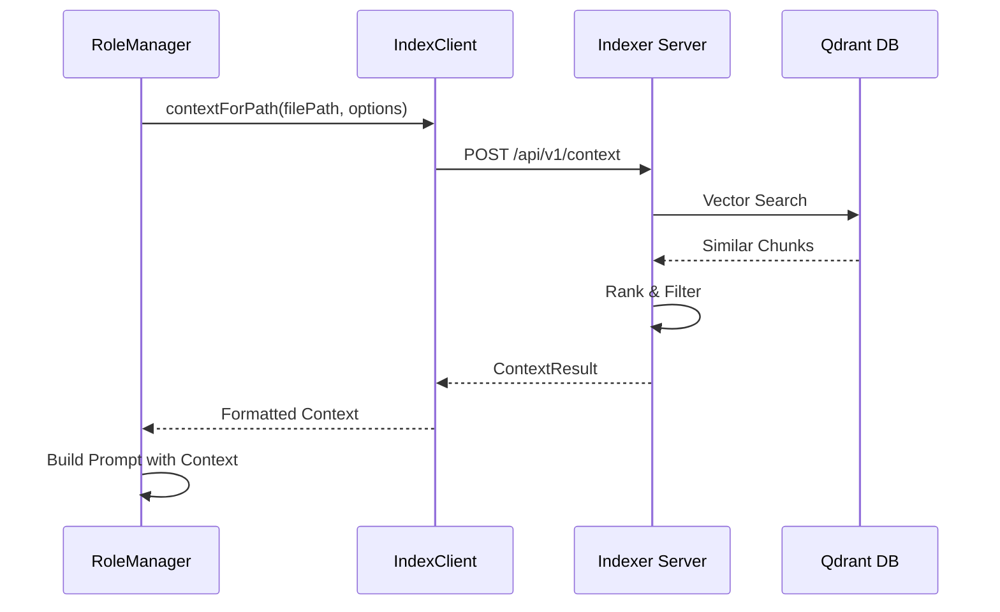

# RAG_IMPLEMENTATION_GUIDE.md

## Geliştirme Dokümanı - RAG (Retrieval-Augmented Generation) Implementasyonu

**Sürüm:** 1.0  
**Tarih:** 5 Mart 2026  
**Hedef AI Agent:** Claude Sonnet 4.5  
**Öncelik:** KRİTİK (Production Blocker)  
**Bağımlılık:** INDEXER_API_DEVELOPMENT.md tamamlanmalı

---

## 1. EKSİKLİK TESPİTİ VE DOĞRULAMA

### 1.1 Eksikliğin Tanımı
**Eksiklik:** `IndexClient.contextForPath()` fonksiyonu "TODO" olarak bırakılmış, RAG (Retrieval-Augmented Generation) mekanizması çalışmıyor.

### 1.2 Eksikliğin Konumu

| Dosya Yolu | Satır | Mevcut Durum | Gereken Durum |
|------------|-------|--------------|---------------|
| `apps/orchestrator/src/indexer/IndexClient.ts` | ~150-180 | `// TODO: implement` | Tam RAG implementasyonu |
| `apps/orchestrator/src/roles/RoleManager.ts` | - | Domain context placeholder | RAG entegrasyonu |
| `apps/indexer/src/api/IndexController.ts` | - | getContext endpoint yok | Endpoint implementasyonu |

### 1.3 Doğrulama Adımları

AI Agent, geliştirmeye başlamadan önce şu dosyaları inceleyerek eksikliği doğrulamalıdır:

```bash
# 1. IndexClient.ts dosyasında TODO ara
grep -n "TODO" apps/orchestrator/src/indexer/IndexClient.ts

# 2. contextForPath fonksiyonunu bul
grep -A 20 "contextForPath" apps/orchestrator/src/indexer/IndexClient.ts

# 3. RoleManager.ts'de domain context kullanımını incele
grep -n "domainContext\|contextForPath" apps/orchestrator/src/roles/RoleManager.ts

# 4. Indexer tarafında getContext endpoint'i kontrol et
grep -n "getContext\|/context" apps/indexer/src/api/IndexController.ts
```

**Beklenen Bulgular:**
- `IndexClient.ts` içinde `contextForPath` fonksiyonu boş veya "TODO" içeriyor
- `RoleManager.ts` domain context'i placeholder olarak alıyor
- Indexer'da `/api/v1/context` endpoint'i yok

---

## 2. RAG SİSTEMİ MİMARİSİ

### 2.1 Genel Akış



### 2.2 Bileşenler

| Bileşen | Konum | Sorumluluk |
|---------|-------|------------|
| **IndexClient** | Orchestrator | Indexer API istemcisi |
| **ContextBuilder** | Orchestrator | Context formatlama |
| **Indexer API** | Indexer | HTTP endpoint |
| **VectorIndex** | Indexer | Qdrant sorguları |
| **ContextRanker** | Indexer | Chunk sıralama |

---

## 3. GELİŞTİRME TALİMATLARI

### 3.1 Adım 1: IndexClient.contextForPath Implementasyonu

**Dosya:** `apps/orchestrator/src/indexer/IndexClient.ts`

**Mevcut Kod (Muhtemelen):**
```typescript
async contextForPath(path: string, options?: ContextOptions): Promise<ContextResult> {
  // TODO: implement
  return { context: [], related: [] };
}
```

**Yeni Implementasyon:**
```typescript
// apps/orchestrator/src/indexer/IndexClient.ts

import axios, { AxiosInstance } from 'axios';
import { z } from 'zod';

// Types
export interface ContextOptions {
  maxChunks?: number;          // Maksimum chunk sayısı (default: 10)
  maxTokens?: number;          // Token limiti (default: 4000)
  includeRelated?: boolean;    // İlgili chunk'ları da getir (default: true)
  includeImports?: boolean;    // Import edilen dosyaları dahil et (default: true)
  includeTests?: boolean;      // Test dosyalarını dahil et (default: false)
  minRelevanceScore?: number;  // Minimum relevance skoru (default: 0.5)
  domainFilter?: string[];     // Domain bazlı filtreleme
}

export interface ContextChunk {
  id: string;
  content: string;
  filePath: string;
  startLine: number;
  endLine: number;
  language: string;
  relevanceScore: number;
  metadata: {
    functionName?: string;
    className?: string;
    moduleName?: string;
    imports?: string[];
    exports?: string[];
  };
}

export interface ContextResult {
  primary: ContextChunk[];      // Ana context chunk'ları
  related: ContextChunk[];      // İlgili chunk'lar
  imports: ContextChunk[];      // Import edilen dosyalar
  summary: {
    totalTokens: number;
    totalChunks: number;
    coverage: number;           // 0-1 arası kapsam skoru
  };
}

export class IndexClient {
  private client: AxiosInstance;
  private baseUrl: string;
  private apiKey: string;
  private timeout: number;

  constructor(config?: { baseUrl?: string; apiKey?: string; timeout?: number }) {
    this.baseUrl = config?.baseUrl || process.env.INDEXER_URL || 'http://localhost:9001';
    this.apiKey = config?.apiKey || process.env.INDEXER_API_KEY || '';
    this.timeout = config?.timeout || 30000;

    this.client = axios.create({
      baseURL: this.baseUrl,
      timeout: this.timeout,
      headers: {
        'Content-Type': 'application/json',
        'x-api-key': this.apiKey,
      },
    });
  }

  /**
   * Belirli bir dosya yolu için RAG context'i getirir.
   * 
   * @param path - Dosya yolu (örn: "/src/auth/login.ts")
   * @param options - Context seçenekleri
   * @returns ContextResult - Formatlanmış context
   */
  async contextForPath(path: string, options?: ContextOptions): Promise<ContextResult> {
    const defaultOptions: ContextOptions = {
      maxChunks: 10,
      maxTokens: 4000,
      includeRelated: true,
      includeImports: true,
      includeTests: false,
      minRelevanceScore: 0.5,
    };

    const mergedOptions = { ...defaultOptions, ...options };

    try {
      // 1. Ana context'i getir
      const response = await this.client.post('/api/v1/context', {
        path,
        options: {
          maxChunks: mergedOptions.maxChunks,
          includeRelated: mergedOptions.includeRelated,
          minRelevanceScore: mergedOptions.minRelevanceScore,
        },
      });

      const data = response.data;

      // 2. Import'ları getir (opsiyonel)
      let imports: ContextChunk[] = [];
      if (mergedOptions.includeImports && data.context.length > 0) {
        imports = await this.fetchImports(data.context, mergedOptions);
      }

      // 3. Token sayısını hesapla ve sınırlandır
      const allChunks = [...data.context, ...data.related, ...imports];
      const tokenLimitedChunks = this.limitByTokens(allChunks, mergedOptions.maxTokens || 4000);

      // 4. Summary hesapla
      const summary = {
        totalTokens: this.estimateTokens(tokenLimitedChunks),
        totalChunks: tokenLimitedChunks.length,
        coverage: this.calculateCoverage(data.context, path),
      };

      return {
        primary: data.context,
        related: data.related || [],
        imports,
        summary,
      };
    } catch (error) {
      if (axios.isAxiosError(error)) {
        throw new Error(`Indexer API error: ${error.message}`);
      }
      throw error;
    }
  }

  /**
   * Domain bazlı context getirir.
   * 
   * @param domain - Domain adı (örn: "authentication", "payment")
   * @param options - Context seçenekleri
   */
  async contextForDomain(domain: string, options?: ContextOptions): Promise<ContextResult> {
    const response = await this.client.post('/api/v1/context/domain', {
      domain,
      options,
    });

    return response.data;
  }

  /**
   * Sorgu bazlı semantic search yapar.
   * 
   * @param query - Arama sorgusu
   * @param options - Search seçenekleri
   */
  async semanticSearch(query: string, options?: { limit?: number; threshold?: number }): Promise<ContextChunk[]> {
    const response = await this.client.post('/api/v1/search', {
      query,
      options,
    });

    return response.data.results.map((r: any) => ({
      id: r.id,
      content: r.chunk,
      filePath: r.metadata.filePath,
      startLine: r.metadata.startLine,
      endLine: r.metadata.endLine,
      language: r.metadata.language,
      relevanceScore: r.score,
      metadata: r.metadata,
    }));
  }

  /**
   * Birden fazla dosya için toplu context getirir.
   * 
   * @param paths - Dosya yolları listesi
   * @param options - Context seçenekleri
   */
  async contextForPaths(paths: string[], options?: ContextOptions): Promise<Map<string, ContextResult>> {
    const results = new Map<string, ContextResult>();

    // Parallel fetching
    const promises = paths.map(async (path) => {
      const context = await this.contextForPath(path, options);
      return { path, context };
    });

    const responses = await Promise.all(promises);
    responses.forEach(({ path, context }) => {
      results.set(path, context);
    });

    return results;
  }

  // Private helper metodlar

  private async fetchImports(chunks: ContextChunk[], options: ContextOptions): Promise<ContextChunk[]> {
    const importPaths = new Set<string>();

    // Chunk'lardaki import path'lerini topla
    chunks.forEach((chunk) => {
      if (chunk.metadata.imports) {
        chunk.metadata.imports.forEach((imp) => {
          // Relative import'ları resolve et
          const resolvedPath = this.resolveImportPath(imp, chunk.filePath);
          if (resolvedPath) {
            importPaths.add(resolvedPath);
          }
        });
      }
    });

    if (importPaths.size === 0) {
      return [];
    }

    // Import dosyalarının context'ini getir
    const importChunks: ContextChunk[] = [];
    for (const path of Array.from(importPaths).slice(0, 5)) { // Max 5 import
      try {
        const response = await this.client.post('/api/v1/context', {
          path,
          options: { maxChunks: 2 },
        });
        importChunks.push(...response.data.context.slice(0, 2));
      } catch {
        // Import bulunamadıysa devam et
        continue;
      }
    }

    return importChunks;
  }

  private resolveImportPath(importPath: string, fromPath: string): string | null {
    // Node.js style import resolution
    if (importPath.startsWith('.')) {
      const dir = fromPath.substring(0, fromPath.lastIndexOf('/'));
      const resolved = `${dir}/${importPath}`;
      return resolved.replace(/\/\.\//g, '/').replace(/\/[^/]+\/\.\.\//g, '/');
    }
    return null; // External package
  }

  private limitByTokens(chunks: ContextChunk[], maxTokens: number): ContextChunk[] {
    const result: ContextChunk[] = [];
    let totalTokens = 0;

    for (const chunk of chunks) {
      const chunkTokens = this.estimateTokens([chunk]);
      if (totalTokens + chunkTokens <= maxTokens) {
        result.push(chunk);
        totalTokens += chunkTokens;
      } else {
        break;
      }
    }

    return result;
  }

  private estimateTokens(chunks: ContextChunk[]): number {
    // Basit token tahmini: ~4 karakter = 1 token
    return chunks.reduce((total, chunk) => {
      return total + Math.ceil(chunk.content.length / 4);
    }, 0);
  }

  private calculateCoverage(chunks: ContextChunk[], targetPath: string): number {
    if (chunks.length === 0) return 0;

    const targetChunks = chunks.filter((c) => c.filePath === targetPath);
    return targetChunks.length / chunks.length;
  }
}

// Singleton instance
let indexClientInstance: IndexClient | null = null;

export function getIndexClient(): IndexClient {
  if (!indexClientInstance) {
    indexClientInstance = new IndexClient();
  }
  return indexClientInstance;
}
```

### 3.2 Adım 2: ContextBuilder Servisi

**Dosya:** `apps/orchestrator/src/indexer/ContextBuilder.ts`

**Görevler:**
1. Context formatlama
2. Prompt için hazır context oluşturma
3. Token optimizasyonu

**Kod Yapısı:**
```typescript
// apps/orchestrator/src/indexer/ContextBuilder.ts

import { ContextResult, ContextChunk, IndexClient, getIndexClient } from './IndexClient';

export interface FormattedContext {
  /** LLM prompt'una eklenecek hazır metin */
  text: string;
  
  /** Token sayısı */
  tokenCount: number;
  
  /** Kaynak dosyalar */
  sources: string[];
  
  /** Domain bazlı gruplandırma */
  byDomain: Map<string, ContextChunk[]>;
}

export class ContextBuilder {
  private client: IndexClient;

  constructor() {
    this.client = getIndexClient();
  }

  /**
   * Role için formatlanmış context oluşturur.
   * 
   * @param role - Rol adı (legacy_analysis, architect, migration, security)
   * @param targetPath - Hedef dosya yolu
   * @param options - Format seçenekleri
   */
  async buildForRole(
    role: 'legacy_analysis' | 'architect' | 'migration' | 'security' | 'aggregator',
    targetPath: string,
    options?: {
      maxTokens?: number;
      includeTests?: boolean;
      focusDomains?: string[];
    }
  ): Promise<FormattedContext> {
    // Role göre context stratejisi belirle
    const strategy = this.getRoleStrategy(role);

    // Context getir
    const context = await this.client.contextForPath(targetPath, {
      maxChunks: strategy.maxChunks,
      maxTokens: options?.maxTokens || strategy.maxTokens,
      includeRelated: strategy.includeRelated,
      includeImports: strategy.includeImports,
      includeTests: options?.includeTests || strategy.includeTests,
      domainFilter: options?.focusDomains,
    });

    // Formatla
    return this.format(context, strategy.formatStyle);
  }

  /**
   * Domain bazlı context oluşturur.
   */
  async buildForDomain(
    domain: string,
    options?: { maxTokens?: number }
  ): Promise<FormattedContext> {
    const context = await this.client.contextForDomain(domain, {
      maxTokens: options?.maxTokens || 4000,
    });

    return this.format(context, 'domain');
  }

  /**
   * Multi-file context oluşturur.
   */
  async buildForFiles(
    paths: string[],
    options?: { maxTokens?: number }
  ): Promise<FormattedContext> {
    const contexts = await this.client.contextForPaths(paths, {
      maxTokens: (options?.maxTokens || 8000) / paths.length,
    });

    // Tüm context'leri birleştir
    const merged: ContextResult = {
      primary: [],
      related: [],
      imports: [],
      summary: { totalTokens: 0, totalChunks: 0, coverage: 1 },
    };

    contexts.forEach((ctx) => {
      merged.primary.push(...ctx.primary);
      merged.related.push(...ctx.related);
      merged.imports.push(...ctx.imports);
    });

    return this.format(merged, 'multi-file');
  }

  // Private metodlar

  private getRoleStrategy(role: string): {
    maxChunks: number;
    maxTokens: number;
    includeRelated: boolean;
    includeImports: boolean;
    includeTests: boolean;
    formatStyle: 'full' | 'summary' | 'domain' | 'multi-file';
  } {
    const strategies = {
      legacy_analysis: {
        maxChunks: 20,
        maxTokens: 6000,
        includeRelated: true,
        includeImports: true,
        includeTests: false,
        formatStyle: 'full' as const,
      },
      architect: {
        maxChunks: 15,
        maxTokens: 5000,
        includeRelated: true,
        includeImports: true,
        includeTests: false,
        formatStyle: 'summary' as const,
      },
      migration: {
        maxChunks: 25,
        maxTokens: 7000,
        includeRelated: true,
        includeImports: true,
        includeTests: true,
        formatStyle: 'full' as const,
      },
      security: {
        maxChunks: 15,
        maxTokens: 4000,
        includeRelated: false,
        includeImports: true,
        includeTests: false,
        formatStyle: 'summary' as const,
      },
      aggregator: {
        maxChunks: 30,
        maxTokens: 8000,
        includeRelated: true,
        includeImports: true,
        includeTests: false,
        formatStyle: 'full' as const,
      },
    };

    return strategies[role as keyof typeof strategies] || strategies.architect;
  }

  private format(context: ContextResult, style: string): FormattedContext {
    const sources = new Set<string>();
    const byDomain = new Map<string, ContextChunk[]>();

    // Tüm chunk'ları topla
    const allChunks = [...context.primary, ...context.related, ...context.imports];

    // Domain'lere göre grupla
    allChunks.forEach((chunk) => {
      sources.add(chunk.filePath);
      
      const domain = this.extractDomain(chunk.filePath);
      if (!byDomain.has(domain)) {
        byDomain.set(domain, []);
      }
      byDomain.get(domain)!.push(chunk);
    });

    // Metin formatla
    let text = '';

    if (style === 'full') {
      text = this.formatFull(allChunks);
    } else if (style === 'summary') {
      text = this.formatSummary(allChunks);
    } else if (style === 'domain') {
      text = this.formatByDomain(byDomain);
    } else if (style === 'multi-file') {
      text = this.formatMultiFile(allChunks);
    }

    return {
      text,
      tokenCount: this.estimateTokens(text),
      sources: Array.from(sources),
      byDomain,
    };
  }

  private formatFull(chunks: ContextChunk[]): string {
    const sections = chunks.map((chunk) => {
      return `### File: ${chunk.filePath}
### Lines: ${chunk.startLine}-${chunk.endLine}
### Relevance: ${(chunk.relevanceScore * 100).toFixed(1)}%

\`\`\`${chunk.language}
${chunk.content}
\`\`\`

`;
    });

    return sections.join('\n---\n');
  }

  private formatSummary(chunks: ContextChunk[]): string {
    const grouped = new Map<string, ContextChunk[]>();
    
    chunks.forEach((chunk) => {
      const file = chunk.filePath;
      if (!grouped.has(file)) {
        grouped.set(file, []);
      }
      grouped.get(file)!.push(chunk);
    });

    const sections = Array.from(grouped.entries()).map(([file, fileChunks]) => {
      const functions = fileChunks
        .filter((c) => c.metadata.functionName)
        .map((c) => c.metadata.functionName)
        .join(', ');

      const classes = fileChunks
        .filter((c) => c.metadata.className)
        .map((c) => c.metadata.className)
        .join(', ');

      return `**${file}**
- Functions: ${functions || 'N/A'}
- Classes: ${classes || 'N/A'}
- Chunks: ${fileChunks.length}
- Top Relevance: ${(Math.max(...fileChunks.map((c) => c.relevanceScore)) * 100).toFixed(1)}%
`;
    });

    return sections.join('\n');
  }

  private formatByDomain(byDomain: Map<string, ContextChunk[]>): string {
    const sections = Array.from(byDomain.entries()).map(([domain, chunks]) => {
      const files = [...new Set(chunks.map((c) => c.filePath))];
      return `## Domain: ${domain}
Files: ${files.length}
Chunks: ${chunks.length}

${chunks.slice(0, 3).map((c) => `- ${c.filePath}:${c.startLine}-${c.endLine}`).join('\n')}
`;
    });

    return sections.join('\n---\n');
  }

  private formatMultiFile(chunks: ContextChunk[]): string {
    const byFile = new Map<string, ContextChunk[]>();
    
    chunks.forEach((chunk) => {
      if (!byFile.has(chunk.filePath)) {
        byFile.set(chunk.filePath, []);
      }
      byFile.get(chunk.filePath)!.push(chunk);
    });

    const sections = Array.from(byFile.entries()).map(([file, fileChunks]) => {
      return `## ${file}
${fileChunks.map((c) => c.content).join('\n\n')}
`;
    });

    return sections.join('\n---\n');
  }

  private extractDomain(filePath: string): string {
    // Basit domain çıkarma
    const parts = filePath.split('/');
    if (parts.includes('auth')) return 'authentication';
    if (parts.includes('payment')) return 'payment';
    if (parts.includes('api')) return 'api';
    if (parts.includes('admin')) return 'admin';
    if (parts.includes('frontend') || parts.includes('ui')) return 'frontend';
    return 'core';
  }

  private estimateTokens(text: string): number {
    return Math.ceil(text.length / 4);
  }
}

// Singleton
let contextBuilderInstance: ContextBuilder | null = null;

export function getContextBuilder(): ContextBuilder {
  if (!contextBuilderInstance) {
    contextBuilderInstance = new ContextBuilder();
  }
  return contextBuilderInstance;
}
```

### 3.3 Adım 3: RoleManager RAG Entegrasyonu

**Dosya:** `apps/orchestrator/src/roles/RoleManager.ts`

**Değişiklikler:**
1. ContextBuilder entegrasyonu
2. Role prompt'larına context ekleme

**Kod Değişiklikleri:**
```typescript
// apps/orchestrator/src/roles/RoleManager.ts

import { getContextBuilder, FormattedContext } from '../indexer/ContextBuilder';

export class RoleManager {
  private contextBuilder = getContextBuilder();

  /**
   * Rol çalıştırır ve RAG context'i ekler.
   */
  async executeRole(params: {
    role: string;
    targetPath: string;
    prompt: string;
    models: ModelConfig[];
  }): Promise<RoleOutput> {
    // 1. RAG Context getir
    const context = await this.contextBuilder.buildForRole(
      params.role as any,
      params.targetPath
    );

    // 2. Prompt'u context ile zenginleştir
    const enrichedPrompt = this.enrichPromptWithContext(
      params.prompt,
      context,
      params.role
    );

    // 3. Model çağrılarını yap
    const results = await this.callModels(params.models, enrichedPrompt);

    return {
      role: params.role,
      context: {
        sources: context.sources,
        tokenCount: context.tokenCount,
      },
      results,
    };
  }

  private enrichPromptWithContext(
    prompt: string,
    context: FormattedContext,
    role: string
  ): string {
    const roleContextInstructions = {
      legacy_analysis: `
You have access to the following code context from the legacy codebase.
Use this context to understand the existing architecture and identify patterns.

CONTEXT:
${context.text}

---
`,
      architect: `
Here is the relevant code context for your architectural analysis.
Focus on structural patterns and dependencies.

CONTEXT:
${context.text}

---
`,
      migration: `
The following context shows the current codebase structure.
Use it to plan the migration strategy.

CONTEXT:
${context.text}

---
`,
      security: `
Here is the code context for security analysis.
Focus on authentication, authorization, and data handling patterns.

CONTEXT:
${context.text}

---
`,
      aggregator: `
The following context contains code samples from all analyzed domains.
Use it to create a comprehensive final report.

CONTEXT:
${context.text}

---
`,
    };

    const instruction = roleContextInstructions[role as keyof typeof roleContextInstructions] 
      || roleContextInstructions.architect;

    return `${instruction}\n\nTASK:\n${prompt}`;
  }

  // ... mevcut metodlar
}
```

### 3.4 Adım 4: Indexer getContext Endpoint

**Dosya:** `apps/indexer/src/api/IndexController.ts`

**Eklenenler:**
```typescript
// apps/indexer/src/api/IndexController.ts

// ... mevcut kod

export const IndexController = {
  // ... mevcut metodlar

  async getContext(
    request: FastifyRequest<ContextRequest>,
    reply: FastifyReply
  ) {
    const { path, options } = request.body;

    try {
      const vectorIndex = new VectorIndex();

      // 1. Path'e göre chunk'ları bul
      const pathChunks = await vectorIndex.getByPath(path, {
        limit: options?.maxChunks || 10,
      });

      if (pathChunks.length === 0) {
        return {
          context: [],
          related: [],
          message: 'No chunks found for the specified path',
        };
      }

      // 2. Semantic search ile ilgili chunk'ları bul
      let related = [];
      if (options?.includeRelated !== false) {
        // İlk chunk'ı query olarak kullan
        const queryEmbedding = pathChunks[0].embedding;
        related = await vectorIndex.search(queryEmbedding, {
          limit: 5,
          threshold: 0.7,
          excludePaths: [path], // Aynı path'i hariç tut
        });
      }

      // 3. Response hazırla
      return {
        context: pathChunks.map((c) => ({
          id: c.id,
          content: c.content,
          filePath: c.metadata.filePath,
          startLine: c.metadata.startLine,
          endLine: c.metadata.endLine,
          language: c.metadata.language,
          relevanceScore: c.score || 1.0,
          metadata: {
            functionName: c.metadata.functionName,
            className: c.metadata.className,
            moduleName: c.metadata.moduleName,
            imports: c.metadata.imports,
            exports: c.metadata.exports,
          },
        })),
        related: related.map((c) => ({
          id: c.id,
          content: c.content,
          filePath: c.metadata.filePath,
          startLine: c.metadata.startLine,
          endLine: c.metadata.endLine,
          language: c.metadata.language,
          relevanceScore: c.score,
          metadata: c.metadata,
        })),
      };
    } catch (error) {
      request.log.error({ error, path }, 'Failed to get context');
      reply.code(500).send({
        error: 'Failed to retrieve context',
        message: error instanceof Error ? error.message : 'Unknown error',
      });
    }
  },

  async getContextForDomain(
    request: FastifyRequest<DomainContextRequest>,
    reply: FastifyReply
  ) {
    const { domain, options } = request.body;

    const vectorIndex = new VectorIndex();

    // Domain bazlı arama
    const chunks = await vectorIndex.searchByDomain(domain, {
      limit: options?.maxChunks || 15,
    });

    return {
      context: chunks,
      related: [],
    };
  },
};
```

### 3.5 Adım 5: VectorIndex Metodları

**Dosya:** `apps/indexer/src/vector_index/VectorIndex.ts`

**Eklenen metodlar:**
```typescript
// apps/indexer/src/vector_index/VectorIndex.ts

export class VectorIndex {
  // ... mevcut metodlar

  /**
   * Path'e göre chunk'ları getirir.
   */
  async getByPath(
    path: string,
    options?: { limit?: number }
  ): Promise<IndexedChunk[]> {
    const limit = options?.limit || 10;

    // Qdrant scroll with filter
    const result = await this.client.scroll(this.collectionName, {
      filter: {
        must: [
          {
            key: 'metadata.filePath',
            match: { value: path },
          },
        ],
      },
      limit,
      with_payload: true,
      with_vector: true,
    });

    return result.points.map((point) => ({
      id: point.id.toString(),
      content: point.payload?.content as string,
      embedding: point.vector as number[],
      metadata: point.payload?.metadata as ChunkMetadata,
    }));
  }

  /**
   * Domain bazlı arama yapar.
   */
  async searchByDomain(
    domain: string,
    options?: { limit?: number }
  ): Promise<IndexedChunk[]> {
    const limit = options?.limit || 15;

    // Domain metadata'sına göre filtrele
    const result = await this.client.scroll(this.collectionName, {
      filter: {
        should: [
          {
            key: 'metadata.filePath',
            match: { text: `/${domain}/` },
          },
          {
            key: 'metadata.moduleName',
            match: { value: domain },
          },
        ],
      },
      limit,
      with_payload: true,
    });

    return result.points.map((point) => ({
      id: point.id.toString(),
      content: point.payload?.content as string,
      metadata: point.payload?.metadata as ChunkMetadata,
      score: 1.0,
    }));
  }

  /**
   * Chunk'ların import'larını getirir.
   */
  async getImportsForChunks(
    chunks: IndexedChunk[]
  ): Promise<IndexedChunk[]> {
    const importPaths = new Set<string>();

    chunks.forEach((chunk) => {
      if (chunk.metadata.imports) {
        chunk.metadata.imports.forEach((imp) => {
          importPaths.add(imp);
        });
      }
    });

    const results: IndexedChunk[] = [];

    for (const importPath of Array.from(importPaths).slice(0, 10)) {
      const chunks = await this.getByPath(importPath, { limit: 2 });
      results.push(...chunks);
    }

    return results;
  }
}
```

---

## 4. TEST SENARYOLARI

### 4.1 Unit Testler

```typescript
// apps/orchestrator/src/indexer/__tests__/IndexClient.test.ts

import { describe, it, expect, vi, beforeEach } from 'vitest';
import { IndexClient } from '../IndexClient';

// Mock axios
vi.mock('axios');

describe('IndexClient', () => {
  let client: IndexClient;

  beforeEach(() => {
    client = new IndexClient({
      baseUrl: 'http://test:9001',
      apiKey: 'test-key',
    });
  });

  describe('contextForPath', () => {
    it('should return formatted context for a path', async () => {
      // Mock response
      const mockResponse = {
        data: {
          context: [
            {
              id: '1',
              content: 'function login() {}',
              filePath: '/src/auth/login.ts',
              startLine: 1,
              endLine: 10,
              language: 'typescript',
              relevanceScore: 0.95,
              metadata: {},
            },
          ],
          related: [],
        },
      };

      // Test
      const result = await client.contextForPath('/src/auth/login.ts');

      expect(result.primary).toHaveLength(1);
      expect(result.primary[0].filePath).toBe('/src/auth/login.ts');
      expect(result.summary.totalChunks).toBeGreaterThan(0);
    });

    it('should respect maxTokens option', async () => {
      const result = await client.contextForPath('/src/auth/login.ts', {
        maxTokens: 100,
      });

      expect(result.summary.totalTokens).toBeLessThanOrEqual(100);
    });

    it('should throw error when API fails', async () => {
      await expect(
        client.contextForPath('/nonexistent')
      ).rejects.toThrow();
    });
  });

  describe('semanticSearch', () => {
    it('should return search results', async () => {
      const results = await client.semanticSearch('authentication', {
        limit: 5,
      });

      expect(results.length).toBeLessThanOrEqual(5);
      results.forEach((r) => {
        expect(r).toHaveProperty('content');
        expect(r).toHaveProperty('relevanceScore');
      });
    });
  });
});
```

### 4.2 Integration Testler

```typescript
// apps/orchestrator/src/indexer/__tests__/ContextBuilder.integration.test.ts

import { describe, it, expect, beforeAll } from 'vitest';
import { ContextBuilder } from '../ContextBuilder';

describe('ContextBuilder Integration', () => {
  let builder: ContextBuilder;

  beforeAll(() => {
    builder = new ContextBuilder();
  });

  it('should build context for legacy_analysis role', async () => {
    const result = await builder.buildForRole(
      'legacy_analysis',
      '/src/auth/login.ts'
    );

    expect(result.text).toContain('File:');
    expect(result.tokenCount).toBeGreaterThan(0);
    expect(result.sources.length).toBeGreaterThan(0);
  });

  it('should build context for domain', async () => {
    const result = await builder.buildForDomain('authentication');

    expect(result.byDomain.has('authentication')).toBe(true);
  });

  it('should build context for multiple files', async () => {
    const result = await builder.buildForFiles([
      '/src/auth/login.ts',
      '/src/auth/register.ts',
    ]);

    expect(result.sources).toHaveLength(2);
  });
});
```

---

## 5. DOĞRULAMA KRİTERLERİ

### 5.1 Fonksiyonel Doğrulama

```bash
# 1. Indexer'da context endpoint'i test et
curl -X POST http://localhost:9001/api/v1/context \
  -H "Content-Type: application/json" \
  -H "x-api-key: test-key" \
  -d '{"path": "/src/auth/login.ts", "options": {"maxChunks": 5}}'

# 2. Orchestrator'dan context iste
curl -X POST http://localhost:7001/api/v1/pipeline/run \
  -H "Content-Type: application/json" \
  -d '{
    "mode": "full_analysis",
    "targetPath": "/src/auth/login.ts"
  }'

# 3. Log'larda RAG kullanımını kontrol et
grep "contextForPath" /var/log/orchestrator/pipeline.log
```

### 5.2 Performans Doğrulama

```bash
# Context getirme süresi
time curl -X POST http://localhost:9001/api/v1/context \
  -H "x-api-key: test-key" \
  -d '{"path": "/src/auth/login.ts"}'

# Beklenen: < 500ms
```

---

## 6. RİSKLER VE DİKKAT EDİLECEK NOKTALAR

### 6.1 Performans

| Risk | Önlem |
|------|-------|
| Yavaş vector search | Index optimizasyonu, caching |
| Büyük context | Token limiti, chunking |
| Çok fazla import | Import limiti (max 5) |

### 6.2 Kalite

| Risk | Önlem |
|------|-------|
| Düşük relevance | Minimum threshold (0.5) |
| Eksik context | Multi-pass retrieval |
| Token overflow | Hard limit enforcement |

---

## 7. SONRAKI ADIMLAR

Bu geliştirme tamamlandıktan sonra:

1. **PRODUCTION_HARDENING.md** - Rate limiting ve circuit breaker
2. **TEST_STRATEGY.md** - Kapsamlı test coverage
3. **OBSERVABILITY_SETUP.md** - Logging ve tracing

---

## 8. REFERANSLAR

- [RAG Paper](https://arxiv.org/abs/2005.11401)
- [Qdrant Dokümantasyonu](https://qdrant.tech/documentation/)
- [LangChain RAG](https://python.langchain.com/docs/use_cases/question_answering/)

---

**Doküman Sahibi:** GLM-5 Architect Mode  
**Son Güncelleme:** 5 Mart 2026  
**Durum:** GELİŞTİRMEYE HAZIR
