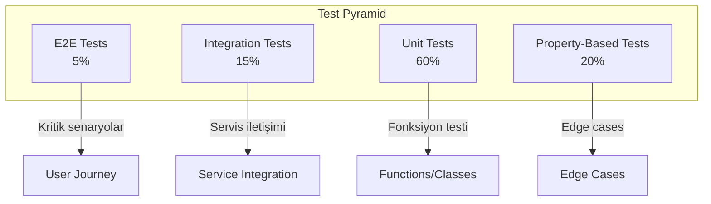

# TEST_STRATEGY.md

## Geliştirme Dokümanı - Kapsamlı Test Stratejisi

**Sürüm:** 1.0  
**Tarih:** 5 Mart 2026  
**Hedef AI Agent:** Claude Sonnet 4.5  
**Öncelik:** YÜKSEK (Production Readiness)  
**Bağımlılık:** Tüm önceki geliştirme dokümanları

---

## 1. EKSİKLİK TESPİTİ VE DOĞRULAMA

### 1.1 Eksikliğin Tanımı

| Eksiklik | Açıklama | Mevcut Durum |
|----------|----------|--------------|
| **Unit Test Coverage** | Modül bazlı testler eksik | ~7 test dosyası var, coverage düşük |
| **Integration Tests** | Servisler arası testler yok | Yok |
| **Property-Based Tests** | Generative testler yok | Yok |
| **E2E Tests** | End-to-end senaryo testleri yok | Yok |
| **Load Tests** | Performans testleri yok | Yok |
| **Contract Tests** | API contract testleri yok | Yok |

### 1.2 Eksikliğin Konumları

| Dizin | Mevcut Durum | Gereken Durum |
|-------|--------------|---------------|
| `apps/orchestrator/src/__tests__/` | 7 test dosyası | 20+ test dosyası |
| `apps/indexer/src/__tests__/` | 1 test dosyası | 10+ test dosyası |
| `apps/mcp_bridge/src/__tests__/` | Yok | 5+ test dosyası |
| `tests/integration/` | Yok | Oluşturulmalı |
| `tests/e2e/` | Yok | Oluşturulmalı |
| `tests/load/` | Yok | Oluşturulmalı |

### 1.3 Doğrulama Adımları

AI Agent, geliştirmeye başlamadan önce şu komutları çalıştırarak eksikliği doğrulamalıdır:

```bash
# 1. Mevcut test dosyalarını say
find apps -name "*.test.ts" -o -name "*.spec.ts" | wc -l

# 2. Test coverage'ı kontrol et
cd apps/orchestrator && pnpm test:coverage

# 3. Mevcut test yapılandırmasını incele
cat vitest.config.ts

# 4. Test dizin yapısını kontrol et
tree -d apps/orchestrator/src/__tests__ 2>/dev/null || echo "No test directory"

# 5. Integration test dizini kontrol et
ls -la tests/ 2>/dev/null || echo "No tests directory"
```

**Beklenen Bulgular:**
- Test dosyası sayısı < 15
- Coverage < 50%
- Integration/E2E test dizinleri yok

---

## 2. TEST PİRAMİDİ MİMARİSİ

### 2.1 Test Katmanları



### 2.2 Hedef Coverage

| Katman | Hedef Coverage | Şu Anki |
|--------|----------------|---------|
| Unit Tests | 80% | ~30% |
| Integration Tests | 70% | 0% |
| E2E Tests | Kritik senaryolar | 0% |
| Property-Based | Key fonksiyonlar | 0% |

---

## 3. GELİŞTİRME TALİMATLARI

### 3.1 Adım 1: Test Altyapısı Kurulumu

#### 3.1.1 Vitest Konfigürasyonu Güncelleme

**Dosya:** `vitest.config.ts`

**Kod:**
```typescript
// vitest.config.ts

import { defineConfig } from 'vitest/config';
import tsconfigPaths from 'vite-tsconfig-paths';

export default defineConfig({
  plugins: [tsconfigPaths()],
  
  test: {
    globals: true,
    environment: 'node',
    include: ['**/*.{test,spec}.{ts,tsx}'],
    exclude: ['node_modules', 'dist', 'coverage'],
    
    // Coverage configuration
    coverage: {
      provider: 'v8',
      reporter: ['text', 'json', 'html', 'lcov'],
      exclude: [
        'node_modules/**',
        'dist/**',
        '**/*.d.ts',
        '**/*.config.*',
        '**/__tests__/**',
        'coverage/**',
      ],
      thresholds: {
        lines: 80,
        functions: 80,
        branches: 70,
        statements: 80,
      },
      all: true,
    },

    // Timeout settings
    testTimeout: 30000,
    hookTimeout: 30000,

    // Parallel execution
    pool: 'threads',
    poolOptions: {
      threads: {
        singleThread: false,
        minThreads: 1,
        maxThreads: 4,
      },
    },

    // Setup files
    setupFiles: ['./tests/setup/globalSetup.ts'],
    
    // Global test utilities
    globalSetup: ['./tests/setup/globalSetup.ts'],
  },
});
```

#### 3.1.2 Global Test Setup

**Dosya:** `tests/setup/globalSetup.ts`

**Kod:**
```typescript
// tests/setup/globalSetup.ts

import { beforeAll, afterAll, afterEach, vi } from 'vitest';

// Mock environment variables for tests
process.env.NODE_ENV = 'test';
process.env.LOG_LEVEL = 'error';
process.env.INDEXER_API_KEY = 'test-api-key';
process.env.OPENAI_API_KEY = 'sk-test-openai';
process.env.ANTHROPIC_API_KEY = 'sk-test-anthropic';

// Global timeout
vi.setConfig({
  testTimeout: 30000,
  hookTimeout: 30000,
});

// Console suppression for cleaner test output
const originalConsole = { ...console };
beforeAll(() => {
  console.log = vi.fn();
  console.info = vi.fn();
  console.warn = vi.fn();
  // Keep console.error for debugging
});

afterAll(() => {
  Object.assign(console, originalConsole);
});

// Cleanup after each test
afterEach(() => {
  vi.clearAllMocks();
});

// Export for type declarations
declare global {
  namespace Vi {
    interface Assertion {
      toBeValidUuid(): void;
      toBeValidTimestamp(): void;
    }
  }
}

// Custom matchers
expect.extend({
  toBeValidUuid(received: string) {
    const uuidRegex = /^[0-9a-f]{8}-[0-9a-f]{4}-[1-5][0-9a-f]{3}-[89ab][0-9a-f]{3}-[0-9a-f]{12}$/i;
    const pass = uuidRegex.test(received);
    return {
      pass,
      message: () => `expected ${received} ${pass ? 'not to be' : 'to be'} a valid UUID`,
    };
  },
  toBeValidTimestamp(received: number) {
    const pass = !isNaN(received) && received > 0 && received <= Date.now() + 86400000;
    return {
      pass,
      message: () => `expected ${received} ${pass ? 'not to be' : 'to be'} a valid timestamp`,
    };
  },
});
```

#### 3.1.3 Test Utilities

**Dosya:** `tests/utils/testUtils.ts`

**Kod:**
```typescript
// tests/utils/testUtils.ts

import { vi, Mock } from 'vitest';
import axios from 'axios';

/**
 * Mock axios instance creator
 */
export function createMockAxios(response: any, error?: Error) {
  const mockAxios = vi.mocked(axios.create);
  
  if (error) {
    mockAxios.mockReturnValue({
      get: vi.fn().mockRejectedValue(error),
      post: vi.fn().mockRejectedValue(error),
      put: vi.fn().mockRejectedValue(error),
      delete: vi.fn().mockRejectedValue(error),
    } as any);
  } else {
    mockAxios.mockReturnValue({
      get: vi.fn().mockResolvedValue({ data: response }),
      post: vi.fn().mockResolvedValue({ data: response }),
      put: vi.fn().mockResolvedValue({ data: response }),
      delete: vi.fn().mockResolvedValue({ data: response }),
    } as any);
  }
  
  return mockAxios;
}

/**
 * Wait for condition
 */
export async function waitFor(
  condition: () => boolean | Promise<boolean>,
  timeout: number = 5000,
  interval: number = 100
): Promise<void> {
  const startTime = Date.now();
  
  while (Date.now() - startTime < timeout) {
    if (await condition()) {
      return;
    }
    await new Promise((resolve) => setTimeout(resolve, interval));
  }
  
  throw new Error(`Condition not met within ${timeout}ms`);
}

/**
 * Generate random test data
 */
export const TestDataGenerator = {
  uuid: () => `${Math.random().toString(36).substring(2, 10)}-${Date.now()}`,
  
  filePath: () => `/src/module${Math.floor(Math.random() * 100)}/file${Math.floor(Math.random() * 10)}.ts`,
  
  codeChunk: (lines: number = 10) => {
    const chunks = [];
    for (let i = 0; i < lines; i++) {
      chunks.push(`// Line ${i + 1}\nconst var${i} = ${Math.random()};`);
    }
    return chunks.join('\n');
  },
  
  searchQuery: () => {
    const queries = [
      'authentication function',
      'database connection',
      'API endpoint handler',
      'user validation',
      'payment processing',
    ];
    return queries[Math.floor(Math.random() * queries.length)];
  },
  
  modelResponse: (content?: string) => ({
    id: `response-${Date.now()}`,
    content: content || 'This is a test model response',
    model: 'test-model',
    usage: {
      promptTokens: 100,
      completionTokens: 50,
      totalTokens: 150,
    },
  }),
  
  pipelineContext: () => ({
    runId: TestDataGenerator.uuid(),
    mode: 'full_analysis',
    startTime: Date.now(),
    config: {
      models: {},
      timeout: 30000,
    },
  }),
};

/**
 * Mock Fastify request/reply
 */
export function mockFastifyRequest(overrides: Partial<any> = {}) {
  return {
    body: {},
    params: {},
    query: {},
    headers: {},
    ip: '127.0.0.1',
    id: 'test-request-id',
    log: {
      info: vi.fn(),
      error: vi.fn(),
      warn: vi.fn(),
      debug: vi.fn(),
    },
    ...overrides,
  } as any;
}

export function mockFastifyReply() {
  const reply: any = {
    code: vi.fn().mockReturnThis(),
    send: vi.fn().mockReturnThis(),
    header: vi.fn().mockReturnThis(),
    status: vi.fn().mockReturnThis(),
  };
  return reply;
}

/**
 * Spy creator with auto-restore
 */
export function createSpy<T extends (...args: any[]) => any>(
  fn: T
): Mock<Parameters<T>, ReturnType<T>> {
  return vi.fn(fn);
}
```

### 3.2 Adım 2: Unit Tests

#### 3.2.1 Pipeline Engine Tests

**Dosya:** `apps/orchestrator/src/__tests__/PipelineEngine.comprehensive.test.ts`

**Kod:**
```typescript
// apps/orchestrator/src/__tests__/PipelineEngine.comprehensive.test.ts

import { describe, it, expect, beforeEach, afterEach, vi } from 'vitest';
import { PipelineEngine } from '../core/PipelineEngine';
import { TestDataGenerator, waitFor } from '../../../tests/utils/testUtils';

describe('PipelineEngine', () => {
  let engine: PipelineEngine;

  beforeEach(() => {
    engine = new PipelineEngine();
  });

  afterEach(() => {
    vi.clearAllMocks();
  });

  describe('Initialization', () => {
    it('should initialize with default config', () => {
      expect(engine).toBeDefined();
      expect(engine.getStatus()).toBe('idle');
    });

    it('should accept custom config', () => {
      const customEngine = new PipelineEngine({
        timeout: 60000,
        maxRetries: 5,
      });
      expect(customEngine).toBeDefined();
    });
  });

  describe('State Machine', () => {
    it('should transition through all states in order', async () => {
      const stateTransitions: string[] = [];
      
      engine.on('stateChange', (state: string) => {
        stateTransitions.push(state);
      });

      await engine.run({
        mode: 'quick_diagnostic',
        targetPath: '/test/project',
      });

      expect(stateTransitions).toEqual([
        'load_config',
        'ensure_index_ready',
        'perform_sampling',
        'execute_roles',
        'dual_aggregation',
        'generate_final_report',
        'complete',
      ]);
    });

    it('should handle state transition errors', async () => {
      // Mock index check to fail
      vi.spyOn(engine, 'ensureIndexReady').mockRejectedValue(
        new Error('Index not ready')
      );

      await expect(
        engine.run({ mode: 'full_analysis', targetPath: '/test' })
      ).rejects.toThrow('Index not ready');

      expect(engine.getStatus()).toBe('error');
    });

    it('should be idempotent on retry', async () => {
      const runId = TestDataGenerator.uuid();
      
      // First run
      const result1 = await engine.run({
        mode: 'quick_diagnostic',
        runId,
        targetPath: '/test',
      });

      // Retry with same runId
      const result2 = await engine.run({
        mode: 'quick_diagnostic',
        runId,
        targetPath: '/test',
      });

      expect(result1.runId).toBe(result2.runId);
    });
  });

  describe('Timeout Handling', () => {
    it('should timeout long-running operations', async () => {
      vi.spyOn(engine, 'executeRoles').mockImplementation(
        () => new Promise((resolve) => setTimeout(resolve, 60000))
      );

      await expect(
        engine.run({ mode: 'full_analysis', targetPath: '/test', timeout: 1000 })
      ).rejects.toThrow('timeout');
    });

    it('should allow custom timeout per mode', async () => {
      const quickEngine = new PipelineEngine({ timeout: 5000 });
      const startTime = Date.now();

      await expect(
        quickEngine.run({ mode: 'full_analysis', targetPath: '/test' })
      ).rejects.toThrow();

      const elapsed = Date.now() - startTime;
      expect(elapsed).toBeLessThan(10000); // Should timeout within 10s
    });
  });

  describe('Cancellation', () => {
    it('should support cancellation mid-execution', async () => {
      const runPromise = engine.run({
        mode: 'full_analysis',
        targetPath: '/test',
      });

      // Cancel after 100ms
      setTimeout(() => engine.cancel(), 100);

      await expect(runPromise).rejects.toThrow('cancelled');
    });

    it('should cleanup resources on cancellation', async () => {
      const cleanupSpy = vi.spyOn(engine, 'cleanup');

      const runPromise = engine.run({
        mode: 'full_analysis',
        targetPath: '/test',
      });

      setTimeout(() => engine.cancel(), 100);

      await expect(runPromise).rejects.toThrow();
      expect(cleanupSpy).toHaveBeenCalled();
    });
  });

  describe('Context Management', () => {
    it('should accumulate context across states', async () => {
      await engine.run({
        mode: 'quick_diagnostic',
        targetPath: '/test',
      });

      const context = engine.getContext();
      
      expect(context).toHaveProperty('config');
      expect(context).toHaveProperty('index');
      expect(context).toHaveProperty('sampling');
      expect(context).toHaveProperty('roleOutputs');
    });

    it('should preserve context between retries', async () => {
      const runId = TestDataGenerator.uuid();

      // First attempt fails at role execution
      vi.spyOn(engine, 'executeRoles')
        .mockRejectedValueOnce(new Error('Temporary error'))
        .mockResolvedValueOnce({});

      try {
        await engine.run({ mode: 'quick_diagnostic', runId, targetPath: '/test' });
      } catch (e) {
        // Expected
      }

      // Retry
      vi.restoreAllMocks();
      await engine.run({ mode: 'quick_diagnostic', runId, targetPath: '/test' });

      const context = engine.getContext();
      expect(context.runId).toBe(runId);
    });
  });
});
```

#### 3.2.2 Model Gateway Tests

**Dosya:** `apps/orchestrator/src/models/__tests__/ModelGateway.test.ts`

**Kod:**
```typescript
// apps/orchestrator/src/models/__tests__/ModelGateway.test.ts

import { describe, it, expect, beforeEach, vi } from 'vitest';
import { ModelGateway } from '../ModelGateway';
import { TestDataGenerator, createMockAxios } from '../../../../tests/utils/testUtils';

describe('ModelGateway', () => {
  let gateway: ModelGateway;

  beforeEach(() => {
    gateway = new ModelGateway();
    vi.clearAllMocks();
  });

  describe('Provider Selection', () => {
    it('should select correct adapter for OpenAI', async () => {
      const adapter = gateway.getAdapter('openai');
      expect(adapter).toBeDefined();
      expect(adapter.provider).toBe('openai');
    });

    it('should select correct adapter for Anthropic', async () => {
      const adapter = gateway.getAdapter('anthropic');
      expect(adapter).toBeDefined();
      expect(adapter.provider).toBe('anthropic');
    });

    it('should throw for unknown provider', () => {
      expect(() => gateway.getAdapter('unknown')).toThrow('Unknown provider');
    });
  });

  describe('Model Calls', () => {
    it('should call model with correct parameters', async () => {
      const mockResponse = TestDataGenerator.modelResponse();
      createMockAxios(mockResponse);

      const result = await gateway.callModel({
        provider: 'openai',
        model: 'gpt-4',
        prompt: 'Test prompt',
        system: 'You are a helpful assistant',
      });

      expect(result.content).toBeDefined();
      expect(result.model).toBe('test-model');
    });

    it('should handle streaming responses', async () => {
      const chunks = ['Hello', ' ', 'World'];
      const mockStream = async function* () {
        for (const chunk of chunks) {
          yield { content: chunk };
        }
      };

      vi.spyOn(gateway, 'streamModel').mockImplementation(mockStream);

      const result: string[] = [];
      for await (const chunk of gateway.streamModel({
        provider: 'openai',
        model: 'gpt-4',
        prompt: 'Test',
      })) {
        result.push(chunk.content);
      }

      expect(result).toEqual(chunks);
    });

    it('should respect token limits', async () => {
      const mockResponse = TestDataGenerator.modelResponse();
      createMockAxios(mockResponse);

      await gateway.callModel({
        provider: 'openai',
        model: 'gpt-4',
        prompt: 'Test',
        options: { maxTokens: 100 },
      });

      // Verify maxTokens was passed to adapter
    });
  });

  describe('Retry Logic', () => {
    it('should retry on transient errors', async () => {
      const mockCall = vi.fn()
        .mockRejectedValueOnce(new Error('Network error'))
        .mockRejectedValueOnce(new Error('Timeout'))
        .mockResolvedValueOnce(TestDataGenerator.modelResponse());

      vi.spyOn(gateway, 'executeCall').mockImplementation(mockCall);

      const result = await gateway.callModel({
        provider: 'openai',
        model: 'gpt-4',
        prompt: 'Test',
      });

      expect(mockCall).toHaveBeenCalledTimes(3);
      expect(result).toBeDefined();
    });

    it('should not retry on non-retryable errors', async () => {
      const mockCall = vi.fn().mockRejectedValue(
        new Error('Invalid API key')
      );

      vi.spyOn(gateway, 'executeCall').mockImplementation(mockCall);

      await expect(
        gateway.callModel({
          provider: 'openai',
          model: 'gpt-4',
          prompt: 'Test',
        })
      ).rejects.toThrow('Invalid API key');

      expect(mockCall).toHaveBeenCalledTimes(1);
    });

    it('should use exponential backoff', async () => {
      const delays: number[] = [];
      const originalSetTimeout = global.setTimeout;
      
      vi.spyOn(global, 'setTimeout').mockImplementation((fn: any, delay?: number) => {
        if (delay) delays.push(delay);
        return originalSetTimeout(fn, 0);
      });

      const mockCall = vi.fn()
        .mockRejectedValueOnce(new Error('Error 1'))
        .mockRejectedValueOnce(new Error('Error 2'))
        .mockResolvedValueOnce(TestDataGenerator.modelResponse());

      vi.spyOn(gateway, 'executeCall').mockImplementation(mockCall);

      await gateway.callModel({
        provider: 'openai',
        model: 'gpt-4',
        prompt: 'Test',
      });

      // Verify exponential backoff: 1000, 2000, 4000...
      expect(delays.length).toBeGreaterThan(0);
    });
  });

  describe('Error Handling', () => {
    it('should normalize errors from different providers', async () => {
      const providers = ['openai', 'anthropic', 'gemini'];
      
      for (const provider of providers) {
        vi.spyOn(gateway, 'executeCall').mockRejectedValue(
          new Error(`${provider} error`)
        );

        try {
          await gateway.callModel({
            provider,
            model: 'test-model',
            prompt: 'Test',
          });
        } catch (error: any) {
          expect(error).toHaveProperty('provider');
          expect(error).toHaveProperty('message');
          expect(error).toHaveProperty('retryable');
        }
      }
    });
  });
});
```

#### 3.2.3 Indexer Tests

**Dosya:** `apps/indexer/src/__tests__/Indexer.test.ts`

**Kod:**
```typescript
// apps/indexer/src/__tests__/Indexer.test.ts

import { describe, it, expect, beforeEach, vi } from 'vitest';
import { Scanner } from '../scanner/Scanner';
import { Chunker } from '../chunker/Chunker';
import { EmbeddingEngine } from '../embedding/EmbeddingEngine';
import { VectorIndex } from '../vector_index/VectorIndex';
import { TestDataGenerator } from '../../../tests/utils/testUtils';

describe('Indexer Components', () => {
  describe('Scanner', () => {
    let scanner: Scanner;

    beforeEach(() => {
      scanner = new Scanner('/test/project', []);
    });

    it('should scan directory for files', async () => {
      const files = await scanner.scan();
      expect(Array.isArray(files)).toBe(true);
    });

    it('should respect exclude patterns', async () => {
      const excludeScanner = new Scanner('/test/project', [
        'node_modules/**',
        '*.test.ts',
        'dist/**',
      ]);

      const files = await excludeScanner.scan();
      
      files.forEach((file) => {
        expect(file.path).not.toContain('node_modules');
        expect(file.path).not.toContain('.test.ts');
        expect(file.path).not.toContain('dist');
      });
    });

    it('should respect max file size', async () => {
      const sizeLimitedScanner = new Scanner('/test/project', [], {
        maxFileSize: 1024 * 1024, // 1MB
      });

      const files = await sizeLimitedScanner.scan();
      
      files.forEach((file) => {
        expect(file.size).toBeLessThanOrEqual(1024 * 1024);
      });
    });
  });

  describe('Chunker', () => {
    let chunker: Chunker;

    beforeEach(() => {
      chunker = new Chunker({
        chunkSize: 500,
        chunkOverlap: 50,
      });
    });

    it('should chunk file into appropriate sizes', async () => {
      const content = TestDataGenerator.codeChunk(100);
      const chunks = await chunker.chunk(content);

      chunks.forEach((chunk) => {
        expect(chunk.content.length).toBeLessThanOrEqual(500);
      });
    });

    it('should maintain overlap between chunks', async () => {
      const content = TestDataGenerator.codeChunk(50);
      const chunks = await chunker.chunk(content);

      if (chunks.length > 1) {
        // Check overlap exists between consecutive chunks
        for (let i = 1; i < chunks.length; i++) {
          const prevEnd = chunks[i - 1].content.slice(-100);
          const currStart = chunks[i].content.slice(0, 100);
          
          // There should be some overlap
          expect(
            prevEnd.split('\n').some((line) => currStart.includes(line))
          ).toBe(true);
        }
      }
    });

    it('should preserve code structure', async () => {
      const code = `
function authenticate(user) {
  return validate(user);
}

class UserService {
  constructor() {
    this.users = [];
  }
}
`;
      const chunks = await chunker.chunk(code);

      // Functions should not be split mid-way
      chunks.forEach((chunk) => {
        const openBraces = (chunk.content.match(/{/g) || []).length;
        const closeBraces = (chunk.content.match(/}/g) || []).length;
        
        // Allow some imbalance at boundaries
        expect(Math.abs(openBraces - closeBraces)).toBeLessThanOrEqual(2);
      });
    });

    it('should handle different languages', async () => {
      const languages = ['typescript', 'python', 'php', 'go'];
      
      for (const lang of languages) {
        const chunks = await chunker.chunk(
          TestDataGenerator.codeChunk(20),
          { language: lang }
        );
        expect(chunks.length).toBeGreaterThan(0);
      }
    });
  });

  describe('EmbeddingEngine', () => {
    let engine: EmbeddingEngine;

    beforeEach(() => {
      engine = new EmbeddingEngine({
        url: 'http://localhost:8000',
        model: 'test-model',
      });
    });

    it('should generate embeddings for text', async () => {
      const texts = ['Hello world', 'Test embedding'];
      
      vi.spyOn(engine, 'embed').mockResolvedValue(
        texts.map(() => ({ embedding: new Array(1024).fill(0.1) }))
      );

      const result = await engine.embed(texts);

      expect(result).toHaveLength(2);
      result.forEach((item) => {
        expect(item.embedding).toHaveLength(1024);
      });
    });

    it('should handle batch embedding', async () => {
      const texts = Array(100).fill('Test text');
      
      vi.spyOn(engine, 'embed').mockResolvedValue(
        texts.map(() => ({ embedding: new Array(1024).fill(0.1) }))
      );

      const result = await engine.embed(texts, { batchSize: 10 });

      expect(result).toHaveLength(100);
    });

    it('should retry on embedding failure', async () => {
      const mockEmbed = vi.fn()
        .mockRejectedValueOnce(new Error('Embedding failed'))
        .mockResolvedValue([{ embedding: new Array(1024).fill(0.1) }]);

      vi.spyOn(engine, 'embed').mockImplementation(mockEmbed);

      await engine.embed(['Test']);

      expect(mockEmbed).toHaveBeenCalledTimes(2);
    });
  });

  describe('VectorIndex', () => {
    let index: VectorIndex;

    beforeEach(() => {
      index = new VectorIndex({
        url: 'http://localhost:6333',
        collection: 'test-collection',
      });
    });

    it('should upsert vectors', async () => {
      const vectors = [
        { id: '1', embedding: new Array(1024).fill(0.1), metadata: {} },
        { id: '2', embedding: new Array(1024).fill(0.2), metadata: {} },
      ];

      await expect(index.upsert(vectors)).resolves.not.toThrow();
    });

    it('should search for similar vectors', async () => {
      const queryVector = new Array(1024).fill(0.15);
      
      vi.spyOn(index, 'search').mockResolvedValue([
        { id: '1', score: 0.95, content: 'Result 1', metadata: {} },
        { id: '2', score: 0.85, content: 'Result 2', metadata: {} },
      ]);

      const results = await index.search(queryVector, { limit: 5 });

      expect(results).toHaveLength(2);
      expect(results[0].score).toBeGreaterThan(results[1].score);
    });

    it('should apply threshold filter', async () => {
      const queryVector = new Array(1024).fill(0.15);
      
      vi.spyOn(index, 'search').mockResolvedValue([
        { id: '1', score: 0.95, content: 'Result 1', metadata: {} },
        { id: '2', score: 0.45, content: 'Result 2', metadata: {} },
      ]);

      const results = await index.search(queryVector, { threshold: 0.5 });

      expect(results).toHaveLength(1);
      expect(results[0].score).toBeGreaterThanOrEqual(0.5);
    });
  });
});
```

### 3.3 Adım 3: Property-Based Tests

**Dosya:** `apps/orchestrator/src/__tests__/property-based.test.ts`

**Kod:**
```typescript
// apps/orchestrator/src/__tests__/property-based.test.ts

import { describe, it, expect } from 'vitest';
import fc from 'fast-check';
import { PipelineEngine } from '../core/PipelineEngine';
import { Aggregator } from '../aggregation/Aggregator';
import { SecurityUtils } from '../middleware/security';

describe('Property-Based Tests', () => {
  describe('Pipeline Engine', () => {
    it('should always produce valid run IDs', () => {
      fc.assert(
        fc.property(
          fc.record({
            mode: fc.constantFrom('quick_diagnostic', 'full_analysis', 'spec_generation'),
            targetPath: fc.string({ minLength: 1, maxLength: 100 }),
          }),
          async (params) => {
            const engine = new PipelineEngine();
            
            // Sanitize path first
            try {
              const sanitizedPath = SecurityUtils.sanitizePath(params.targetPath);
              
              const result = await engine.run({
                ...params,
                targetPath: sanitizedPath,
              });

              expect(result.runId).toMatch(
                /^[0-9a-f]{8}-[0-9a-f]{4}-[1-5][0-9a-f]{3}-[89ab][0-9a-f]{3}-[0-9a-f]{12}$/i
              );
            } catch (e) {
              // Expected for invalid paths
            }
          }
        ),
        { numRuns: 50 }
      );
    });

    it('should be idempotent for same input', () => {
      fc.assert(
        fc.property(
          fc.record({
            mode: fc.constantFrom('quick_diagnostic'),
            targetPath: fc.asciiString({ minLength: 5, maxLength: 50 }),
          }),
          async (params) => {
            const engine = new PipelineEngine();
            const runId = 'test-run-id';

            try {
              const result1 = await engine.run({ ...params, runId });
              const result2 = await engine.run({ ...params, runId });

              expect(result1.runId).toBe(result2.runId);
            } catch (e) {
              // Expected for some inputs
            }
          }
        ),
        { numRuns: 20 }
      );
    });
  });

  describe('Aggregator', () => {
    it('should always produce valid JSON output', () => {
      fc.assert(
        fc.property(
          fc.array(
            fc.record({
              role: fc.string(),
              content: fc.string(),
              metadata: fc.dictionary(fc.string(), fc.string()),
            }),
            { minLength: 1, maxLength: 10 }
          ),
          (roleOutputs) => {
            const aggregator = new Aggregator();
            
            try {
              const result = aggregator.fallback(roleOutputs);
              
              // Should be valid JSON
              expect(() => JSON.parse(JSON.stringify(result))).not.toThrow();
            } catch (e) {
              // Some inputs may fail
            }
          }
        ),
        { numRuns: 100 }
      );
    });
  });

  describe('Security Utils', () => {
    it('should sanitize any string without throwing', () => {
      fc.assert(
        fc.property(fc.string({ maxLength: 10000 }), (input) => {
          expect(() => SecurityUtils.sanitizeString(input)).not.toThrow();
        })
      );
    });

    it('should always produce valid output from sanitizePath', () => {
      fc.assert(
        fc.property(fc.string({ maxLength: 500 }), (input) => {
          try {
            const result = SecurityUtils.sanitizePath(input);
            // Result should not contain path traversal
            expect(result).not.toContain('..');
            // Result should only contain valid characters
            expect(result).toMatch(/^[a-zA-Z0-9\-_/.]*$/);
          } catch (e) {
            // Some inputs are expected to throw
          }
        })
      );
    });

    it('should detect prompt injection patterns', () => {
      fc.assert(
        fc.property(fc.string({ maxLength: 1000 }), (input) => {
          const result = SecurityUtils.sanitizePrompt(input);
          
          // Result should not contain dangerous patterns
          expect(result).not.toMatch(/ignore previous instructions/i);
          expect(result).not.toMatch(/system\s*:\s*you are now/i);
        })
      );
    });
  });

  describe('Model Response Parsing', () => {
    it('should parse any JSON-like response', () => {
      fc.assert(
        fc.property(
          fc.record({
            content: fc.string(),
            model: fc.string(),
            usage: fc.record({
              promptTokens: fc.nat(),
              completionTokens: fc.nat(),
            }),
          }),
          (response) => {
            const json = JSON.stringify(response);
            const parsed = JSON.parse(json);

            expect(parsed).toHaveProperty('content');
            expect(parsed).toHaveProperty('model');
          }
        )
      );
    });
  });
});
```

### 3.4 Adım 4: Integration Tests

**Dosya:** `tests/integration/orchestrator-indexer.integration.test.ts`

**Kod:**
```typescript
// tests/integration/orchestrator-indexer.integration.test.ts

import { describe, it, expect, beforeAll, afterAll } from 'vitest';
import { buildServer as buildOrchestrator } from '../../apps/orchestrator/src/server';
import { buildServer as buildIndexer } from '../../apps/indexer/src/server';
import { FastifyInstance } from 'fastify';
import axios from 'axios';

describe('Orchestrator-Indexer Integration', () => {
  let orchestrator: FastifyInstance;
  let indexer: FastifyInstance;
  let orchestratorUrl: string;
  let indexerUrl: string;

  beforeAll(async () => {
    // Start indexer
    indexer = await buildIndexer();
    await indexer.listen({ port: 0 });
    indexerUrl = `http://localhost:${(indexer.server.address() as any).port}`;

    // Start orchestrator with indexer URL
    process.env.INDEXER_URL = indexerUrl;
    orchestrator = await buildOrchestrator();
    await orchestrator.listen({ port: 0 });
    orchestratorUrl = `http://localhost:${(orchestrator.server.address() as any).port}`;
  });

  afterAll(async () => {
    await orchestrator.close();
    await indexer.close();
  });

  describe('Health Check Integration', () => {
    it('should report indexer health in orchestrator health', async () => {
      const response = await axios.get(`${orchestratorUrl}/health/detailed`);

      expect(response.data).toHaveProperty('checks');
      expect(response.data.checks).toHaveProperty('indexer');
    });
  });

  describe('Pipeline Integration', () => {
    it('should run full pipeline with indexer', async () => {
      // 1. Ensure index
      const ensureResponse = await axios.post(
        `${orchestratorUrl}/api/v1/index/ensure`,
        { projectPath: '/workspace/test-project' },
        { headers: { 'x-api-key': 'test-key' } }
      );

      expect(ensureResponse.status).toBe(200);

      // 2. Run pipeline
      const pipelineResponse = await axios.post(
        `${orchestratorUrl}/api/v1/pipeline/run`,
        {
          mode: 'quick_diagnostic',
          targetPath: '/workspace/test-project',
        },
        { headers: { 'x-api-key': 'test-key' } }
      );

      expect(pipelineResponse.data).toHaveProperty('runId');
    });

    it('should fail pipeline if indexer is unavailable', async () => {
      // Stop indexer
      await indexer.close();

      await expect(
        axios.post(
          `${orchestratorUrl}/api/v1/pipeline/run`,
          { mode: 'quick_diagnostic', targetPath: '/test' },
          { headers: { 'x-api-key': 'test-key' } }
        )
      ).rejects.toThrow();

      // Restart indexer for other tests
      // ...
    });
  });

  describe('Search Integration', () => {
    it('should search indexed content through orchestrator', async () => {
      const response = await axios.post(
        `${orchestratorUrl}/api/v1/search`,
        { query: 'authentication function' },
        { headers: { 'x-api-key': 'test-key' } }
      );

      expect(response.status).toBe(200);
      expect(response.data).toHaveProperty('results');
    });
  });
});
```

### 3.5 Adım 5: E2E Tests

**Dosya:** `tests/e2e/full-workflow.e2e.test.ts`

**Kod:**
```typescript
// tests/e2e/full-workflow.e2e.test.ts

import { describe, it, expect, beforeAll, afterAll } from 'vitest';
import axios from 'axios';

const BASE_URL = process.env.E2E_BASE_URL || 'http://localhost:7001';
const API_KEY = process.env.E2E_API_KEY || 'test-api-key';

describe('E2E: Full Workflow', () => {
  const client = axios.create({
    baseURL: BASE_URL,
    headers: { 'x-api-key': API_KEY },
    timeout: 120000,
  });

  describe('Health Checks', () => {
    it('should have all services healthy', async () => {
      const response = await client.get('/health/detailed');

      expect(response.data.status).toBe('healthy');
      expect(response.data.checks.qdrant).toBe(true);
      expect(response.data.checks.indexer).toBe(true);
      expect(response.data.checks.embedding).toBe(true);
    });
  });

  describe('Quick Diagnostic Workflow', () => {
    it('should complete quick diagnostic', async () => {
      // Start pipeline
      const startResponse = await client.post('/api/v1/pipeline/run', {
        mode: 'quick_diagnostic',
        targetPath: '/workspace/sample-project',
      });

      expect(startResponse.data).toHaveProperty('runId');
      const runId = startResponse.data.runId;

      // Poll for completion
      let status = 'running';
      let attempts = 0;
      const maxAttempts = 60; // 5 minutes

      while (status === 'running' && attempts < maxAttempts) {
        await new Promise((r) => setTimeout(r, 5000));
        
        const statusResponse = await client.get(
          `/api/v1/pipeline/status/${runId}`
        );
        status = statusResponse.data.status;
        attempts++;
      }

      expect(status).toBe('complete');

      // Get result
      const resultResponse = await client.get(
        `/api/v1/pipeline/result/${runId}`
      );

      expect(resultResponse.data).toHaveProperty('report');
      expect(resultResponse.data.report).toHaveProperty('summary');
    });
  });

  describe('Full Analysis Workflow', () => {
    it('should complete full analysis with all roles', async () => {
      const startResponse = await client.post('/api/v1/pipeline/run', {
        mode: 'full_analysis',
        targetPath: '/workspace/sample-project',
      });

      const runId = startResponse.data.runId;

      // Wait for completion
      await waitForCompletion(client, runId, 180000); // 3 minutes

      const resultResponse = await client.get(
        `/api/v1/pipeline/result/${runId}`
      );

      const report = resultResponse.data.report;

      // Verify all roles executed
      expect(report).toHaveProperty('legacyAnalysis');
      expect(report).toHaveProperty('architect');
      expect(report).toHaveProperty('migration');
      expect(report).toHaveProperty('security');
      expect(report).toHaveProperty('aggregator');
    }, 300000); // 5 minute timeout
  });

  describe('Spec Generation Workflow', () => {
    it('should generate spec files', async () => {
      const startResponse = await client.post('/api/v1/pipeline/run', {
        mode: 'spec_generation',
        targetPath: '/workspace/sample-project',
      });

      const runId = startResponse.data.runId;

      await waitForCompletion(client, runId, 180000);

      // Check spec files generated
      const specResponse = await client.get('/api/v1/spec/project_context');

      expect(specResponse.data).toHaveProperty('projectContext');
      expect(specResponse.data.projectContext).toHaveProperty('name');
      expect(specResponse.data.projectContext).toHaveProperty('modules');
    }, 300000);
  });
});

// Helper function
async function waitForCompletion(
  client: ReturnType<typeof axios.create>,
  runId: string,
  timeout: number
): Promise<void> {
  const startTime = Date.now();

  while (Date.now() - startTime < timeout) {
    const response = await client.get(`/api/v1/pipeline/status/${runId}`);
    
    if (response.data.status === 'complete') {
      return;
    }
    
    if (response.data.status === 'error') {
      throw new Error(`Pipeline failed: ${response.data.error}`);
    }

    await new Promise((r) => setTimeout(r, 5000));
  }

  throw new Error('Pipeline timed out');
}
```

### 3.6 Adım 6: Load Tests

**Dosya:** `tests/load/load-test.k6.js`

**Kod:**
```javascript
// tests/load/load-test.k6.js

import http from 'k6/http';
import { check, sleep } from 'k6';
import { Rate, Trend } from 'k6/metrics';

// Custom metrics
const errorRate = new Rate('errors');
const latencyTrend = new Trend('latency');

// Configuration
export const options = {
  stages: [
    { duration: '30s', target: 10 },  // Ramp up to 10 users
    { duration: '1m', target: 10 },   // Stay at 10 users
    { duration: '30s', target: 20 },  // Ramp up to 20 users
    { duration: '1m', target: 20 },   // Stay at 20 users
    { duration: '30s', target: 0 },   // Ramp down
  ],
  thresholds: {
    http_req_duration: ['p(95)<500'], // 95% of requests < 500ms
    errors: ['rate<0.1'],             // Error rate < 10%
  },
};

const BASE_URL = __ENV.BASE_URL || 'http://localhost:7001';
const API_KEY = __ENV.API_KEY || 'test-api-key';

const headers = {
  'Content-Type': 'application/json',
  'x-api-key': API_KEY,
};

export default function () {
  // Test 1: Health check
  const healthResponse = http.get(`${BASE_URL}/health`, { headers });
  check(healthResponse, {
    'health check status is 200': (r) => r.status === 200,
  });

  sleep(1);

  // Test 2: Search endpoint
  const searchResponse = http.post(
    `${BASE_URL}/api/v1/search`,
    JSON.stringify({
      query: 'authentication function',
      options: { limit: 5 },
    }),
    { headers }
  );

  check(searchResponse, {
    'search status is 200': (r) => r.status === 200,
    'search has results': (r) => {
      try {
        const body = JSON.parse(r.body);
        return body.results && body.results.length > 0;
      } catch {
        return false;
      }
    },
  });

  errorRate.add(searchResponse.status !== 200);
  latencyTrend.add(searchResponse.timings.duration);

  sleep(2);

  // Test 3: Pipeline status (lighter than full pipeline)
  const statusResponse = http.get(
    `${BASE_URL}/api/v1/pipeline/status/test-run-id`,
    { headers }
  );

  check(statusResponse, {
    'status endpoint responds': (r) => [200, 404].includes(r.status),
  });

  sleep(1);
}

// Teardown
export function teardown() {
  console.log('Load test completed');
}
```

---

## 4. TEST ÇALIŞTIRMA KOMUTLARI

### 4.1 Package.json Scripts

```json
{
  "scripts": {
    "test": "vitest run",
    "test:watch": "vitest",
    "test:coverage": "vitest run --coverage",
    "test:unit": "vitest run --dir apps",
    "test:integration": "vitest run --dir tests/integration",
    "test:e2e": "vitest run --dir tests/e2e",
    "test:property": "vitest run --grep 'Property-Based'",
    "test:load": "k6 run tests/load/load-test.k6.js",
    "test:all": "pnpm test:unit && pnpm test:integration && pnpm test:e2e"
  }
}
```

### 4.2 CI/CD Konfigürasyonu

**Dosya:** `.github/workflows/test.yml`

```yaml
name: Tests

on:
  push:
    branches: [main, develop]
  pull_request:
    branches: [main]

jobs:
  unit-tests:
    runs-on: ubuntu-latest
    steps:
      - uses: actions/checkout@v3
      - uses: pnpm/action-setup@v2
        with:
          version: 10
      - uses: actions/setup-node@v3
        with:
          node-version: '20'
          cache: 'pnpm'
      - run: pnpm install
      - run: pnpm test:unit
      - run: pnpm test:coverage
      - uses: codecov/codecov-action@v3

  integration-tests:
    runs-on: ubuntu-latest
    services:
      qdrant:
        image: qdrant/qdrant:v1.7.4
        ports:
          - 6333:6333
    steps:
      - uses: actions/checkout@v3
      - uses: pnpm/action-setup@v2
      - uses: actions/setup-node@v3
      - run: pnpm install
      - run: pnpm test:integration
        env:
          QDRANT_URL: http://localhost:6333

  e2e-tests:
    runs-on: ubuntu-latest
    steps:
      - uses: actions/checkout@v3
      - uses: pnpm/action-setup@v2
      - uses: actions/setup-node@v3
      - run: pnpm install
      - run: pnpm build
      - run: docker compose up -d
      - run: sleep 30
      - run: pnpm test:e2e
        env:
          E2E_BASE_URL: http://localhost:7001
```

---

## 5. DOĞRULAMA KRİTERLERİ

### 5.1 Coverage Hedefleri

| Modül | Minimum Coverage |
|-------|------------------|
| Pipeline Engine | 85% |
| Model Gateway | 80% |
| Indexer | 75% |
| Aggregator | 80% |
| Security | 90% |

### 5.2 Test Çalıştırma Doğrulama

```bash
# 1. Tüm testleri çalıştır
pnpm test:all

# 2. Coverage raporu oluştur
pnpm test:coverage

# 3. Coverage threshold kontrolü
if [ $(cat coverage/coverage-summary.json | jq '.total.lines.pct' | cut -d. -f1) -lt 80 ]; then
  echo "Coverage below 80%"
  exit 1
fi

# 4. Load test
k6 run tests/load/load-test.k6.js
```

---

## 6. SONRAKI ADIMLAR

Bu geliştirme tamamlandıktan sonra:

1. **OBSERVABILITY_SETUP.md** - Logging ve tracing

---

**Doküman Sahibi:** GLM-5 Architect Mode  
**Son Güncelleme:** 5 Mart 2026  
**Durum:** GELİŞTİRMEYE HAZIR
